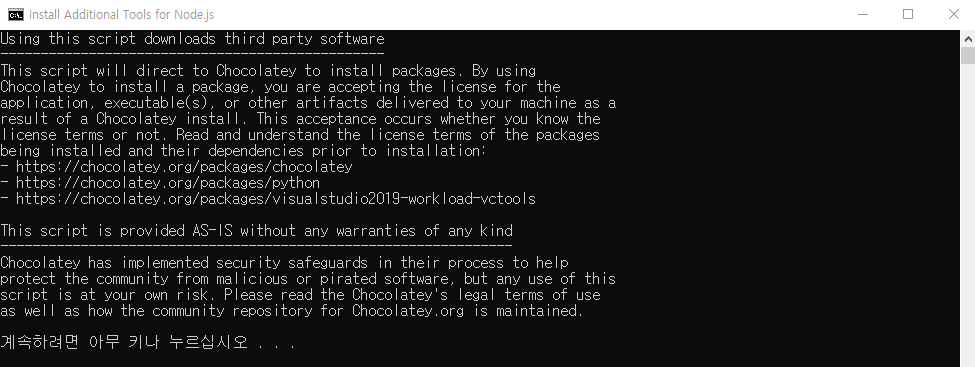
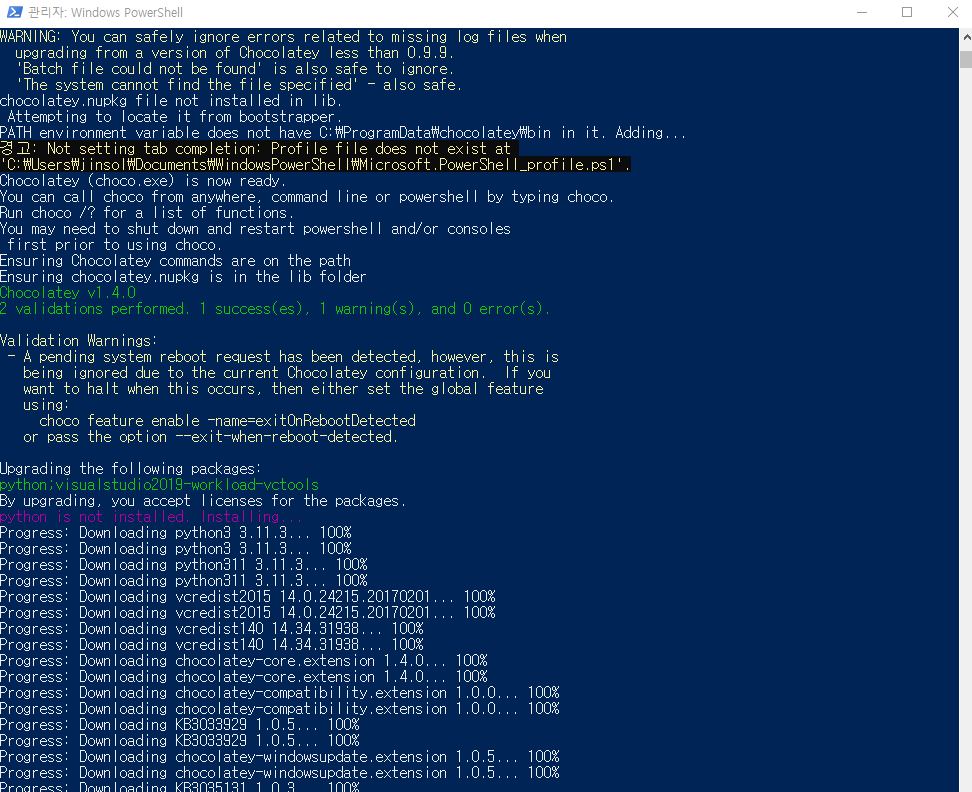

# 1. 자바스크립트의 기본

## 1-1. 콘솔 로그

```javascript
console.log("hello");   //콘솔에 "hello"라는 문자열을 출력합니다.
```

<br><br><br>

## 1-2. 주석

```javascript
/*
    여러 줄 각주
*/
//한 줄 각주
```

JavaScript의 기본적인 내용과 ES6 문법을 주석으로 남깁니다.

<br><br><br>

## 1-3. 변수의 선언 및 할당

### 1-3-1. var 키워드

#### 1-3-1-1. 특징

1. 변수의 스코프 (범위): var로 선언된 변수는 함수 스코프(function scope)를 가집니다. 이는 변수가 선언된 함수 내에서만 유효하다는 것을 의미합니다. 
2. 함수 외부에서 선언된 var 변수는 전역 변수로 작동합니다.
3. 호이스팅 (Hoisting): var로 선언된 변수는 호이스팅에 의해 변수 선언이 코드의 상단으로 끌어올려집니다. 그러나 초기화는 원래의 위치에서 수행됩니다.

<br>

#### 1-3-1-2. 예제

```javascript
function exampleVar() {
    console.log(x); // undefined
    var x = 5;
    console.log(x); // 5
}
exampleVar();
```

위 코드에서 console.log(x);가 처음 호출될 때 undefined가 출력되는 이유는 var 선언이 호이스팅되기 때문입니다.

<br><br>

### 1-3-2. let 키워드

#### 1-3-2-1. 특징

1. 변수의 스코프 (범위): let으로 선언된 변수는 블록 스코프(block scope)를 가집니다. 즉, 변수가 선언된 블록(예: if문, for문) 내에서만 유효합니다.
2. 호이스팅 (Hoisting): let 변수는 호이스팅되지만, 선언 전에는 Temporal Dead Zone (TDZ)에 있어서 접근할 수 없습니다. 이는 변수를 선언하기 전에는 접근할 수 없다는 것을 의미합니다.

<br>

#### 1-3-2-2. 예제

```javascript
function exampleLet() {
    if (true) {
        let y = 10;
        console.log(y); // 10
    }
    console.log(y); // ReferenceError: y is not defined
}
exampleLet();
```

위 코드에서 let y는 if문 블록 내에서만 유효합니다. 블록 밖에서는 접근할 수 없습니다.

<br><br>

### 1-3-3. const 키워드

#### 1-3-3-1. 특징

1. 변수의 스코프 (범위): const로 선언된 변수도 블록 스코프를 가집니다. 따라서 변수는 선언된 블록 내에서만 유효합니다.
2. 상수 (Immutable): const로 선언된 변수는 재할당이 불가능합니다. 즉, 변수의 값을 변경할 수 없습니다. 그러나 객체나 배열의 경우, 객체의 속성이나 배열의 요소는 변경할 수 있습니다.

<br>

#### 1-3-3-2. 예제

```javascript
function exampleConst() {
    const z = 20;
    console.log(z); // 20
    
    // 재할당 시도
    z = 30; // TypeError: Assignment to constant variable.
    
    // 객체의 경우
    const obj = { a: 1 };
    obj.a = 2; // 유효 (객체의 속성 변경)
    console.log(obj.a); // 2
    
    // 배열의 경우
    const arr = [1, 2, 3];
    arr.push(4); // 유효 (배열에 요소 추가)
    console.log(arr); // [1, 2, 3, 4]
}
exampleConst();
```

위 코드에서 const로 선언된 z는 재할당할 수 없지만, 객체와 배열의 경우 내부 요소는 변경할 수 있습니다.

<br><br>

### 1-3-4. 변수 선언의 사용 권장 사항

1. let과 const: ES6에서는 var 대신 let과 const를 사용하는 것이 권장됩니다. 
2. let은 값이 변경될 수 있는 변수를 선언할 때 사용하고, const는 상수를 선언할 때 사용합니다.
3. 블록 스코프 활용: let과 const를 사용하여 블록 스코프를 활용함으로써 코드의 가독성을 높이고, 변수의 생명 주기를 명확하게 할 수 있습니다.
4. 불변성 유지: 가능한 한 const를 사용하여 불변성을 유지하고, let은 필요한 경우에만 사용하여 코드의 예측 가능성을 높이는 것이 좋습니다.

<br><br>

**Ex01_Variable.html**

```html
<!DOCTYPE html>
<html lang="en">
<head>
    <meta charset="UTF-8">
    <meta name="viewport" content="width=device-width, initial-scale=1.0">
    <title>Ex01_Variable</title>
    <script>
        function exampleVar() {
            console.log(x); // undefined
            var x = 5;
            console.log(x); // 5
        }
        exampleVar();
        
        function exampleLet() {
            if (true) {
                let y = 10;
                console.log(y); // 10
            }
            //console.log(y); // ReferenceError: y is not defined
        }
        exampleLet();
        
        function exampleConst() {
            const z = 20;
            console.log(z); // 20
            
            // 재할당 시도
            //z = 30; // TypeError: Assignment to constant variable.
            
            // 객체의 경우
            const obj = { a: 1 };
            obj.a = 2; // 유효 (객체의 속성 변경)
            console.log(obj.a); // 2
            
            // 배열의 경우
            const arr = [1, 2, 3];
            arr.push(4); // 유효 (배열에 요소 추가)
            console.log(arr); // [1, 2, 3, 4]
        }
        exampleConst();    
    </script>
</head>
<body>
    <h2>Ex01_Variable</h2>
</body>
</html>
```


<br><br><br>

## 1-4. 자바스크립트의 연산과 연산 우선 순위

### 1-4-1. 산술 연산자 (Arithmetic Operators)

| 연산자 | 설명                      | 예제       | 결과   |
|--------|---------------------------|------------|--------|
| `+`    | 덧셈                      | `5 + 3`    | `8`    |
| `-`    | 뺄셈                      | `5 - 3`    | `2`    |
| `*`    | 곱셈                      | `5 * 3`    | `15`   |
| `/`    | 나눗셈                    | `6 / 3`    | `2`    |
| `%`    | 나머지                    | `5 % 3`    | `2`    |
| `**`   | 거듭제곱                  | `2 ** 3`   | `8`    |

```javascript
let a = 10;
let b = 5;
console.log(a + b);  // 15
console.log(a - b);  // 5
console.log(a * b);  // 50
console.log(a / b);  // 2
console.log(a % b);  // 0
console.log(2 ** 3); // 8
```

<br><br>

### 1-4-2. 증감 연산자 (Increment and Decrement Operators)

| 연산자 | 설명                | 예제       | 결과   |
|--------|---------------------|------------|--------|
| `++`   | 증가 (전위, 후위)    | `x++`      | `x`는 증가 전의 값, `++x`는 증가 후의 값 |
| `--`   | 감소 (전위, 후위)    | `x--`      | `x`는 감소 전의 값, `--x`는 감소 후의 값 |

```javascript
let x = 5;
console.log(x++);  // 5 (후위 증가)
console.log(x);    // 6
console.log(++x);  // 7 (전위 증가)
console.log(x--);  // 7 (후위 감소)
console.log(x);    // 6
console.log(--x);  // 5 (전위 감소)
```

<br><br>

### 1-4-3. 비교 연산자 (Comparison Operators)

| 연산자 | 설명                           | 예제       | 결과   |
|--------|--------------------------------|------------|--------|
| `==`   | 동등 비교 (타입 변환 허용)      | `5 == '5'` | `true` |
| `===`  | 엄격 동등 비교 (타입 변환 없음)  | `5 === '5'`| `false`|
| `!=`   | 동등하지 않음 (타입 변환 허용)  | `5 != '5'` | `false`|
| `!==`  | 엄격 동등하지 않음 (타입 변환 없음) | `5 !== '5'`| `true` |
| `>`    | 크다                           | `5 > 3`    | `true` |
| `<`    | 작다                           | `5 < 3`    | `false`|
| `>=`   | 크거나 같다                    | `5 >= 5`   | `true` |
| `<=`   | 작거나 같다                    | `5 <= 3`   | `false`|

```javascript
let a = 10;
let b = 5;
console.log(a == b);  // false
console.log(a === 10); // true
console.log(a != b);  // true
console.log(a !== 10); // false
console.log(a > b);   // true
console.log(a < b);   // false
console.log(a >= 10); // true
console.log(a <= 10); // true
```

<br><br>

### 1-4-4. 논리 연산자 (Logical Operators)

| 연산자 | 설명                      | 예제       | 결과   |
|--------|---------------------------|------------|--------|
| `&&`   | 논리 AND (그리고)         | `true && false` | `false`|
| `||`   | 논리 OR (또는)            | `true || false`  | `true` |
| `!`    | 논리 NOT (부정)           | `!true`    | `false`|

```javascript
console.log(true && false); // false
console.log(true || false); // true
console.log(!true);         // false
```

<br><br>

### 1-4-5. 대입 연산자 (Assignment Operators)

| 연산자 | 설명                | 예제       | 결과   |
|--------|---------------------|------------|--------|
| `=`    | 단순 대입           | `x = 5`    | `x`는 `5`|
| `+=`   | 덧셈 후 대입         | `x += 5`   | `x = x + 5`|
| `-=`   | 뺄셈 후 대입         | `x -= 5`   | `x = x - 5`|
| `*=`   | 곱셈 후 대입         | `x *= 5`   | `x = x * 5`|
| `/=`   | 나눗셈 후 대입       | `x /= 5`   | `x = x / 5`|
| `%=`   | 나머지 후 대입       | `x %= 5`   | `x = x % 5`|
| `**=`  | 거듭제곱 후 대입     | `x **= 2`  | `x = x ** 2`|

```javascript
let x = 10;
x += 5;  // x = x + 5 -> x = 15
x -= 3;  // x = x - 3 -> x = 12
x *= 2;  // x = x * 2 -> x = 24
x /= 4;  // x = x / 4 -> x = 6
x %= 2;  // x = x % 2 -> x = 0
x **= 3; // x = x ** 3 -> x = 0
```

<br><br>

### 1-4-6. 이진 연산자 (Bitwise Operators)

| 연산자 | 설명                      | 예제      | 결과   |
|--------|---------------------------|-----------|--------|
| `&`    | 비트 AND                  | `5 & 3`   | `1`    |
| `|`    | 비트 OR                   | `5 | 3`   | `7`    |
| `^`    | 비트 XOR                  | `5 ^ 3`   | `6`    |
| `~`    | 비트 NOT                  | `~5`      | `-6`   |
| `<<`   | 왼쪽 시프트               | `5 << 1`  | `10`   |
| `>>`   | 오른쪽 시프트 (부호 포함)  | `5 >> 1`  | `2`    |
| `>>>`  | 오른쪽 시프트 (부호 없음)  | `5 >>> 1` | `2`    |

```javascript
console.log(5 & 3);   // 1
console.log(5 | 3);   // 7
console.log(5 ^ 3);   // 6
console.log(~5);      // -6
console.log(5 << 1);  // 10
console.log(5 >> 1);  // 2
console.log(5 >>> 1); // 2
```

<br><br>

### 1-4-7. 삼항 연산자 (Ternary Operator)

| 연산자 | 설명                      | 예제         | 결과   |
|--------|---------------------------|--------------|--------|
| `? :`  | 조건 ? 참일 때 값 : 거짓일 때 값 | `a > b ? a : b` | `a` 또는 `b` |

```javascript
let a = 10;
let b = 5;
let result = a > b ? a : b;
console.log(result); // 10
```

<br><br>

### 1-4-8. 기타 연산자 (Other Operators)

| 연산자    | 설명                          | 예제               | 결과   |
|-----------|-------------------------------|--------------------|--------|
| `typeof`  | 데이터 타입 확인              | `typeof 10`        | `number` |
| `instanceof` | 객체의 인스턴스 확인        | `[] instanceof Array` | `true`  |
| `in`      | 객체의 속성 존재 여부 확인    | `'name' in {name: 'John'}` | `true`  |

```javascript
console.log(typeof 42);                  // number
console.log([] instanceof Array);        // true
console.log('name' in {name: 'John'});   // true
```

<br><br>

**Ex02_Operators.html**

```html
<!DOCTYPE html>
<html lang="en">
<head>
    <meta charset="UTF-8">
    <meta name="viewport" content="width=device-width, initial-scale=1.0">
    <title>Ex02_Operators</title>
    <script>
    //    
    let a = 10;
    let b = 5;
    console.log("\nArithmetic Operators");
    console.log(a + b);  // 15
    console.log(a - b);  // 5
    console.log(a * b);  // 50
    console.log(a / b);  // 2
    console.log(a % b);  // 0
    console.log(2 ** 3); // 8    

    let x = 5;
    console.log("\nComparison Operators");
    console.log(x++);  // 5 (후위 증가)
    console.log(x);    // 6
    console.log(++x);  // 7 (전위 증가)
    console.log(x--);  // 7 (후위 감소)
    console.log(x);    // 6
    console.log(--x);  // 5 (전위 감소)

    console.log("\nLogical Operators");
    console.log(true && false); // false
    console.log(true || false); // true
    console.log(!true);         // false

    let y = 10;
    y += 5;  // y = y + 5 -> y = 15
    y -= 3;  // y = y - 3 -> y = 12
    y *= 2;  // y = y * 2 -> y = 24
    y /= 4;  // y = y / 4 -> y = 6
    y %= 2;  // y = y % 2 -> y = 0
    y **= 3; // y = y ** 3 -> y = 0
    console.log("\nAssignment Operators");
    console.log("y : "+y);

    console.log("\nBitwise Operators");
    console.log(5 & 3);   // 1
    console.log(5 | 3);   // 7
    console.log(5 ^ 3);   // 6
    console.log(~5);      // -6
    console.log(5 << 1);  // 10
    console.log(5 >> 1);  // 2
    console.log(5 >>> 1); // 2

    let i = 10;
    let j = 5;
    let result = i > j ? i : j;
    console.log("\nTernary Operator");
    console.log(result); // 10

    console.log("\nOther Operators");
    console.log(typeof 42);                  // number
    console.log([] instanceof Array);        // true
    console.log('name' in {name: 'John'});   // true
    </script>
</head>
<body>
    <h2>Ex02_Operators</h2>
</body>
</html>
```


<br><br>

### 1-4-9. 연산자 우선순위 테이블

| 우선순위 | 연산자 종류  | 연산자                        |
|----------|--------------|-------------------------------|
| 1        | 그룹 1       | `()`                          |
| 2        | 그룹 2       | `++`, `--`, `!`, `~`, `typeof`, `void`, `delete` |
| 3        | 그룹 3       | `**`                          |
| 4        | 그룹 4       | `*`, `/`, `%`                 |
| 5        | 그룹 5       | `+`, `-`                      |
| 6        | 그룹 6       | `<<`, `>>`, `>>>`             |
| 7        | 그룹 7       | `<`, `<=`, `>`, `>=`, `in`, `instanceof` |
| 8        | 그룹 8       | `==`, `!=`, `===`, `!==`      |
| 9        | 그룹 9       | `&`                           |
| 10       | 그룹 10      | `^`                           |
| 11       | 그룹 11      | `|`                           |
| 12       | 그룹 12      | `&&`                          |
| 13       | 그룹 13      | `||`                          |
| 14       | 그룹 14      | `?:`                          |
| 15       | 그룹 15      | `=`, `+=`, `-=`, `*=`, `/=`, `%=` , `**=` |
| 16       | 그룹 16      | `,`                           |

<br>

**Ex03_Operator_Priority.html**

```html
<!DOCTYPE html>
<html lang="en">
<head>
    <meta charset="UTF-8">
    <meta name="viewport" content="width=device-width, initial-scale=1.0">
    <title>Ex03_Opearators_Priority</title>
    <script>
    //괄호 (): 괄호는 가장 높은 우선순위를 가지며, 표현식의 우선순위를 강제로 변경할 수 있습니다.
    let result = (3 + 4) * 5; // (3 + 4) 먼저 계산 후, 결과에 5를 곱합니다.
    console.log(result); // 35

    //증감 연산자 ++, --: 유니크 연산자들은 다음 우선순위를 갖습니다.
    let x = 5;
    result = ++x * 10; // ++x는 x를 먼저 6으로 증가시킨 후 계산합니다.
    console.log(result); // 60

    //곱셈 *, 나눗셈 /, 나머지 %: 이들은 다음 우선순위를 갖습니다.
    result = 5 + 3 * 2; // 3 * 2를 먼저 계산한 후, 5를 더합니다.
    console.log(result); // 11

    //덧셈 +, 뺄셈 -: 이들은 곱셈 연산자보다 낮은 우선순위를 가집니다.
    result = 5 + 2 - 1; // 5에 2를 더한 후 1을 뺍니다.
    console.log(result); // 6

    //비트 시프트 연산자 <<, >>, >>>: 이들은 덧셈과 뺄셈보다 낮은 우선순위를 가집니다.
    result = 5 << 1; // 5를 왼쪽으로 1 비트 시프트합니다 (5 * 2)
    console.log(result); // 10

    //비교 연산자 <, <=, >, >=: 이들은 비트 시프트 연산자보다 낮은 우선순위를 가집니다.
    result = 5 + 3 > 7; // 5 + 3을 계산한 후 결과가 7보다 큰지 비교합니다.
    console.log(result); // true

    //논리 AND &&: 논리 AND는 비교 연산자보다 낮은 우선순위를 가집니다.
    result = 5 > 3 && 8 < 10; // 비교 연산자들 먼저 평가 후, 논리 AND를 적용합니다.
    console.log(result); // true

    //논리 OR ||: 논리 OR는 논리 AND보다 낮은 우선순위를 가집니다.
    result = (5 > 3) || (8 < 10); // 괄호 내의 비교 결과를 논리 OR로 평가합니다.
    console.log(result); // true

    //삼항 연산자 ? :: 삼항 연산자는 논리 OR보다 낮은 우선순위를 가집니다.
    let age = 18;
    result = age >= 18 ? "Adult" : "Minor"; // 조건에 따라 "Adult" 또는 "Minor" 반환
    console.log(result); // "Adult"

    //대입 연산자 =, +=, -= 등: 대입 연산자는 가장 낮은 우선순위를 가집니다.
    x = 5;
    x += 3 * 2; // 3 * 2를 먼저 계산한 후, x에 6을 더합니다.
    console.log(x); // 11    
    </script>
</head>
<body>
    <h2>Ex03_Opearators_Priority</h2>
</body>
</html>
```

<br><br>

## 1-5. 조건문

### 1-5-1. if 문

if 문은 주어진 조건이 참일 때 블록 내의 코드를 실행합니다.

```javascript
let age = 18;

if (age >= 18) {
    console.log("You are an adult.");
}
```

<br><br>

### 1-5.2 if-else 문

if-else 문은 주어진 조건이 참일 때와 거짓일 때 각각 다른 블록을 실행합니다.

```javascript
let age = 16;

if (age >= 18) {
    console.log("You are an adult.");
} else {
    console.log("You are not an adult.");
}
```

<br><br>

### 1-5-3. if~else if~else~ 문

if-else if-else 문은 여러 조건을 평가할 때 사용됩니다.

```javascript
let score = 85;

if (score >= 90) {
    console.log("Grade: A");
} else if (score >= 80) {
    console.log("Grade: B");
} else if (score >= 70) {
    console.log("Grade: C");
} else {
    console.log("Grade: D");
}
```

<br><br>

### 1-5-4. switch 문

switch 문은 여러 가능한 값을 기준으로 다른 블록을 실행합니다.

```javascript
let day = 2;
let dayName;

switch (day) {
    case 1:
        dayName = "Monday";
        break;
    case 2:
        dayName = "Tuesday";
        break;
    case 3:
        dayName = "Wednesday";
        break;
    default:
        dayName = "Unknown";
}

console.log(dayName); // Tuesday
```

<br><br>

**Ex04_Conditional_Statement.html**

```html
<!DOCTYPE html>
<html lang="en">
<head>
    <meta charset="UTF-8">
    <meta name="viewport" content="width=device-width, initial-scale=1.0">
    <title>Ex04_Conditional_Statement</title>
    <script>
    let age = 18;

    if (age >= 18) {
        console.log("You are an adult.");
    }

    age = 16;
    if (age >= 18) {
        console.log("You are an adult.");
    } else {
        console.log("You are not an adult.");
    }

    let score = 85;
    if (score >= 90) {
        console.log("Grade: A");
    } else if (score >= 80) {
        console.log("Grade: B");
    } else if (score >= 70) {
        console.log("Grade: C");
    } else {
        console.log("Grade: D");
    }

    let day = 2;
    let dayName;

    switch (day) {
        case 1:
            dayName = "Monday";
            break;
        case 2:
            dayName = "Tuesday";
            break;
        case 3:
            dayName = "Wednesday";
            break;
        default:
            dayName = "Unknown";
    }

    console.log(dayName); // Tuesday
    </script>
</head>
<body>
    <h2>Ex04_Conditional_Statement</h2>
</body>
</html>
```


<br><br><br>

## 1-6. 반복문

### 1-6-1. for 문

for 문은 초기화, 조건, 그리고 반복 후 작업을 지정하여 반복을 제어합니다.

```javascript
for (let i = 0; i < 5; i++) {
    console.log(i);
}
```

<br><br>

### 1-6-2. while 문

while 문은 조건이 참인 동안 계속 반복합니다.

```javascript
let i = 0;

while (i < 5) {
    console.log(i);
    i++;
}
```

<br><br>

### 1-6-3 do-while 문

do-while 문은 블록을 최소한 한 번은 실행한 후 조건을 평가하여 반복합니다.

```javascript
let i = 0;

do {
    console.log(i);
    i++;
} while (i < 5);
```

<br><br>

### 1-6-4 for...of 문

for...of 문은 배열이나 이터러블 객체의 요소를 반복합니다.

```javascript
let numbers = [1, 2, 3, 4, 5];

for (let number of numbers) {
    console.log(number);
}
```

<br><br>

### 1-6-5. for...in 문

for...in 문은 객체의 속성을 반복합니다.

```javascript
let person = {
    name: "Alice",
    age: 25,
    city: "New York"
};

for (let key in person) {
    console.log(key + ": " + person[key]);
}
```

<br><br>

**Ex05_Looping_Statement.html**

```html
<!DOCTYPE html>
<html lang="en">
<head>
    <meta charset="UTF-8">
    <meta name="viewport" content="width=device-width, initial-scale=1.0">
    <title>Ex05_Looping_Statement</title>
    <script>
    console.log("\n for");
    for (let i = 0; i < 5; i++) {
        console.log(i);
    }    

    console.log("\n while");
    let i = 0;
    while (i < 5) {
        console.log(i);
        i++;
    }

    console.log("\n do~while~");
    i = 0;
    do {
        console.log(i);
        i++;
    } while (i < 5);

    console.log("\n for~of~");
    let numbers = [1, 2, 3, 4, 5];
    for (let number of numbers) {
        console.log(number);
    }

    console.log("\n for~in~");
    let person = {
        name: "Alice",
        age: 25,
        city: "New York"
    };
    for (let key in person) {
        console.log(key + ": " + person[key]);
    }
    </script>
</head>
<body>
    <h2>Ex05_Looping_Statement</h2>
</body>
</html>
```


<br><br><br>

## 1-7. 기타 제어문(Other Control Statement)

### 1-7-1. break

break 문은 현재 반복문 또는 switch 문을 종료합니다.

```javascript
for (let i = 0; i < 10; i++) {
    if (i === 5) {
        break; // i가 5일 때 반복문 종료
    }
    console.log(i);
}
```

<br><br>

### 1-7-2. continue

continue 문은 현재 반복을 종료하고 다음 반복으로 넘어갑니다.

```javascript
for (let i = 0; i < 10; i++) {
    if (i % 2 === 0) {
        continue; // 짝수는 건너뛰고 다음 반복으로 넘어감
    }
    console.log(i); // 홀수만 출력
}
```

<br><br>

### 1-7-3. return

return 문은 함수의 실행을 종료하고 값을 반환합니다.

```javascript
function add(a, b) {
    return a + b;
}

let sum = add(5, 10);
console.log(sum); // 15
```

<br><br>

### 1-7-4. throw

throw 문은 사용자 정의 예외를 발생시킵니다.

```javascript
function checkAge(age) {
    if (age < 18) {
        throw new Error("You must be at least 18 years old.");
    }
    return "Access granted.";
}

try {
    console.log(checkAge(16));
} catch (e) {
    console.error(e.message); // You must be at least 18 years old.
}
```

<br><br>

**Ex06_Other_Control_Statement.html**

```html
<!DOCTYPE html>
<html lang="en">
<head>
    <meta charset="UTF-8">
    <meta name="viewport" content="width=device-width, initial-scale=1.0">
    <title>Ex06_Other_Control_Statement</title>
    <script>
    console.log("\nbreak");
    for (let i = 0; i < 10; i++) {
        if (i === 5) {
            break; // i가 5일 때 반복문 종료
        }
        console.log(i);
    }

    console.log("\ncontinue");
    for (let i = 0; i < 10; i++) {
        if (i % 2 === 0) {
            continue; // 짝수는 건너뛰고 다음 반복으로 넘어감
        }
        console.log(i); // 홀수만 출력
    }

    console.log("\nreturn");
    function add(a, b) {
        return a + b;
    }
    let sum = add(5, 10);
    console.log(sum); // 15

    console.log("\nreturn");
    function checkAge(age) {
        if (age < 18) {
            throw new Error("You must be at least 18 years old.");
        }
        return "Access granted.";
    }
    try {
        console.log(checkAge(16));
    } catch (e) {
        console.error(e.message); // You must be at least 18 years old.
    }
    </script>
</head>
<body>
    <h2>Ex06_Other_Control_Statement</h2>
</body>
</html>
```


<br><br>

## 1-8. 사용자 정의 함수

### 1-8-1 함수 선언문

함수 선언문은 function 키워드를 사용하여 함수를 정의합니다. 이 방법으로 정의된 함수는 호이스팅(hoisting)됩니다.

```javascript
function greet(name) {
    return `Hello, ${name}!`;
}

console.log(greet("Alice")); // Output: Hello, Alice!
```

<br><br>

### 1-8-2. 함수 표현식

함수 표현식은 함수가 변수에 할당되는 형태입니다. 함수 표현식은 호이스팅되지 않습니다.

```javascript
const greet = function(name) {
    return `Hello, ${name}!`;
};

console.log(greet("Bob")); // Output: Hello, Bob!
```

<br><br>

### 1-8-3. 화살표 함수 (Arrow Function)

ES6에서 도입된 화살표 함수는 간결한 문법을 제공합니다. 화살표 함수는 this 바인딩을 다르게 처리합니다.

```javascript
const greet = (name) => `Hello, ${name}!`;
console.log(greet("Charlie")); // Output: Hello, Charlie!

//파라미터가 하나인 경우 괄호를 생략할 수 있습니다.
const square = x => x * x;

console.log(square(4)); // Output: 16
```

<br><br>

### 1-8-4. 기본 매개변수 (Default Parameters)

기본 매개변수는 함수 호출 시 인수가 제공되지 않을 경우 사용할 기본값을 지정합니다.

```javascript
function greet(name = "Guest") {
    return `Hello, ${name}!`;
}

console.log(greet()); // Output: Hello, Guest!
console.log(greet("Dave")); // Output: Hello, Dave!
```

<br><br>

### 1-8-5. 나머지 매개변수 (Rest Parameters)

나머지 매개변수는 함수에 전달된 나머지 인수를 배열로 받을 수 있게 해줍니다.

```javascript
function sum(...numbers) {
    return numbers.reduce((acc, curr) => acc + curr, 0);
}

console.log(sum(1, 2, 3, 4)); // Output: 10
```

<br><br>

**Ex07_Function_Statement.html**

```html
<!DOCTYPE html>
<html lang="en">
<head>
    <meta charset="UTF-8">
    <meta name="viewport" content="width=device-width, initial-scale=1.0">
    <title>Ex07_Function_Statement</title>
    <script>
    console.log("\n함수 선언문");
    function greet(name) {
        return `Hello, ${name}!`;
    }
    console.log(greet("Alice")); // Output: Hello, Alice!    

    console.log("\n함수 표현식");
    const greet2 = function(name) {
        return `Hello, ${name}!`;
    };
    console.log(greet2("Bob")); // Output: Hello, Bob!

    console.log("\n화살표 함수 (Arrow Function)");
    const greet3 = (name) => `Hello, ${name}!`;
    console.log(greet3("Charlie")); // Output: Hello, Charlie!
    //파라미터가 하나인 경우 괄호를 생략할 수 있습니다.
    const square = x => x * x;
    console.log(square(4)); // Output: 16

    console.log("\n기본 매개변수 (Default Parameters)");
    function greet4(name = "Guest") {
        return `Hello, ${name}!`;
    }
    console.log(greet4()); // Output: Hello, Guest!
    console.log(greet4("Dave")); // Output: Hello, Dave!

    console.log("\n나머지 매개변수 (Rest Parameters)");
    function sum(...numbers) {
        return numbers.reduce((acc, curr) => acc + curr, 0);
    }
    console.log(sum(1, 2, 3, 4)); // Output: 10
    </script>
</head>
<body>
    <h2>Ex07_Function_Statement</h2>
</body>
</html>
```


<br><br>

**Ex08_Looping&Function_Gugudan.html**

```html
<!DOCTYPE html>
<html lang="en">
<head>
    <meta charset="UTF-8">
    <meta name="viewport" content="width=device-width, initial-scale=1.0">
    <title>Ex08_Looping&Function_Gugudan</title>
    <script>
    // 구구단을 출력하는 함수
    function printMultiplicationTable() {
        const maxNumber = 9; // 출력할 최대 숫자 (구구단 9까지)

        // 2부터 maxNumber까지 반복
        for (let i = 2; i <= maxNumber; i++) {
            let line = ''; // 한 줄을 저장할 변수
            
            // 각 숫자와 i를 곱한 결과를 저장
            for (let j = 1; j <= maxNumber; j++) {
                line += `${i}*${j}=${i*j} `;
            }
            // 줄 바꿈 후 출력
            console.log(line);
        }
    }

    // 함수 호출
    printMultiplicationTable();
    </script>
</head>
<body>
    <h2>Ex08_Looping&Function_Gugudan</h2>
</body>
</html>
```


<br><br><br>

## 1-9. 객체

### 1-9-1. 객체 생성 및 사용

자바스크립트에서 객체는 속성과 메서드를 가진 데이터 구조입니다.

```javascript
const person = {
    name: "Alice",
    age: 30,
    greet() {
        return `Hello, my name is ${this.name}`;
    }
};

console.log(person.name); // Output: Alice
console.log(person.greet()); // Output: Hello, my name is Alice
```

<br><br>

### 1-9-2. 객체 리터럴 단축 표기법

ES6에서는 객체 리터럴에서 속성명을 변수명으로 단축할 수 있습니다.

```javascript
const name = "Bob";
const age = 25;

const person = {
    name,
    age
};

console.log(person); // Output: { name: 'Bob', age: 25 }
```

<br><br>

### 1-9-3. 객체 전개 연산자 (Spread Operator)

객체 전개 연산자는 객체의 속성을 다른 객체로 복사할 때 사용합니다.

```javascript
const person = {
    name: "Charlie",
    age: 35
};

const employee = {
    ...person,
    position: "Developer"
};

console.log(employee); // Output: { name: 'Charlie', age: 35, position: 'Developer' }
```

<br><br>

**Ex09_Object.html**

```html
<!DOCTYPE html>
<html lang="en">
<head>
    <meta charset="UTF-8">
    <meta name="viewport" content="width=device-width, initial-scale=1.0">
    <title>Ex09_Object</title>
    <script>
    const person = {
        name: "Alice",
        age: 30,
        greet() {
            return `Hello, my name is ${this.name}`;
        }
    };
    console.log(person.name); // Output: Alice
    console.log(person.greet()); // Output: Hello, my name is Alice  
    
    const name = "Bob";
    const age = 25;
    const student = {
        name,
        age
    };
    console.log(student); // Output: { name: 'Bob', age: 25 }

    const member = {
        name: "Charlie",
        age: 35
    };
    const employee = {
        ...member,
        position: "Developer"
    };
    console.log(employee); // Output: { name: 'Charlie', age: 35, position: 'Developer' }
    </script>
</head>
<body>
    <h2>Ex09_Object</h2>
</body>
</html>
```


<br><br><br>

## 1-10. 클래스(Class)

### 1-10-1. 클래스 정의

ES6에서 클래스는 객체 지향 프로그래밍을 위한 문법적 설탕(syntactic sugar)입니다. 클래스는 생성자, 메서드, 상속 등을 지원합니다.

```javascript
class Person {
    constructor(name, age) {
        this.name = name;
        this.age = age;
    }

    greet() {
        return `Hello, my name is ${this.name}`;
    }
}

const person = new Person("Diana", 40);

console.log(person.name); // Output: Diana
console.log(person.greet()); // Output: Hello, my name is Diana
```

<br><br>

### 1-10-2. 상속 (Inheritance)

ES6 클래스는 상속을 통해 다른 클래스를 기반으로 새로운 클래스를 만들 수 있습니다.

```javascript
class Animal {
    constructor(name) {
        this.name = name;
    }

    speak() {
        return `${this.name} makes a noise.`;
    }
}

class Dog extends Animal {
    speak() {
        return `${this.name} barks.`;
    }
}

const dog = new Dog("Rex");

console.log(dog.speak()); // Output: Rex barks.
```

<br><br>

### 1-10-3. 클래스 메서드와 정적 메서드

클래스 메서드는 인스턴스에서 호출되는 메서드이고, 정적 메서드는 클래스 자체에서 호출됩니다.

```javascript
class MathUtility {
    static add(a, b) {
        return a + b;
    }

    multiply(a, b) {
        return a * b;
    }
}

console.log(MathUtility.add(2, 3)); // Output: 5
const mathUtil = new MathUtility();
console.log(mathUtil.multiply(2, 3)); // Output: 6
```

<br><br>

### 1-10-4. 프로토타입 상속

자바스크립트는 프로토타입 기반 상속을 사용합니다. ES6 클래스는 이를 더 직관적으로 사용할 수 있게 해줍니다.

```javascript
function Person(name) {
    this.name = name;
}

Person.prototype.greet = function() {
    return `Hello, my name is ${this.name}`;
};

const person = new Person("Eve");

console.log(person.greet()); // Output: Hello, my name is Eve
```

<br><br>

**Ex10_Class.html**

```html
<!DOCTYPE html>
<html lang="en">
<head>
    <meta charset="UTF-8">
    <meta name="viewport" content="width=device-width, initial-scale=1.0">
    <title>Ex10_Class</title>
    <script>
    class Person {
        constructor(name, age) {
            this.name = name;
            this.age = age;
        }
        greet() {
            return `Hello, my name is ${this.name}`;
        }
    }
    const person = new Person("Diana", 40);
    console.log("\n클래스 정의");
    console.log(person.name); // Output: Diana
    console.log(person.greet()); // Output: Hello, my name is Diana    

    
    class Animal {
        constructor(name) {
            this.name = name;
        }
        speak() {
            return `${this.name} makes a noise.`;
        }
    }
    class Dog extends Animal {
        speak() {
            return `${this.name} barks.`;
        }
    }
    const dog = new Dog("Rex");
    console.log("\n상속 (Inheritance)");
    console.log(dog.speak()); // Output: Rex barks.


    class MathUtility {
        static add(a, b) {
            return a + b;
        }
        multiply(a, b) {
            return a * b;
        }
    }
    console.log("\n클래스 메서드와 정적 메서드");
    console.log(MathUtility.add(2, 3)); // Output: 5
    const mathUtil = new MathUtility();
    console.log(mathUtil.multiply(2, 3)); // Output: 6


    function Human(name) {
        this.name = name;
    }
    Human.prototype.greet = function() {
        return `Hello, my name is ${this.name}`;
    };
    const human = new Human("Eve");
    console.log("\n프로토타입 상속");
    console.log(human.greet()); // Output: Hello, my name is Eve
    </script>
</head>
<body>
    <h2>Ex10_Class</h2>
</body>
</html>
```


<br><br><br>

# Node 다운로드 및 설치와 설정

## 1. Node 다운로드

### 1-1. Node.js 홈페이지 접속

[Node.js 홈페이지](https://nodejs.org/en)

<br>

### 1-2. Node.js 다운로드


<br><br>

## 2. Node 설치

**1. 설치 시작**

다운로드 디렉토리에서 `node-v20.11-x64.msi` 또는 `node-v18.16-x64.msi` 를 더블클릭하여 설치 화면이 나오면, [Next] 버튼을 누릅니다.


<br>

**2. 약관 동의 페이지**


<br>

**3. 설치 위치 지정**


<br>

**4. 설치할 패키지 또는 부가기능 선택**


<br>

**5. Native Module 을 위한 도구 선택**


<br>

**6. Node 도구 준비 화면**


<br>

**7. Node 환경 설정**


<br>

**8. Native Module 을 위한 도구 선택**






<br><br>

## 3. Node 기본 명령

### 3-1. Node 설치 확인


<br>

### 3-2. Node 자바스크립트 실행

**1. Hello.js 작성**

```javascript
console.log("Hello");
```

<br>

**2. Node 에서 Hello.js 실행**


<br><br><br>

# 2. 자바스크립트의 심화

## 2-1. 함수의 일급 객체(First-Class Functions)

JavaScript에서는 함수가 일급 객체로 취급됩니다. 즉, 함수는 변수에 할당될 수 있으며, 객체의 속성으로 저장되거나 매개변수로 전달되거나 반환될 수 있습니다.

**Ex11_First_Class.js**

```javascript
const add = function() {};  //add라는 변수에 익명 함수를 할당합니다.

const cal = {add};
const cals = [];    //cal 객체의 속성으로 add 함수를 저장합니다.

function hello(){
    console.log("my call");
}

function greeting(message, name){
    message();
}

greeting(hello, "script");  //hello 함수를 greeting 함수에 매개변수로 전달하여 호출합니다.

function world() {
    return () => { console.log("function return"); }   //world 함수는 다른 함수를 반환합니다.
}
```

Visual Studio Code 에서 [View]-[Terminal] 을 실행하여 내부에서 자바스크립트 파일을 실행할 수 있다.


<br><br><br>

## 2-2. 자바스크립트 화살표 함수 (Arrow Functions)

ES6에서 도입된 문법으로, 함수 표현식을 더 간결하게 작성할 수 있습니다.

**Ex12_Arrow_Function.html**

```html
<!DOCTYPE html>
<html lang="en">
<head>
    <meta charset="UTF-8">
    <meta name="viewport" content="width=device-width, initial-scale=1.0">
    <title>Ex12_Arrow_Function</title>
</head>
<body>
    <div id="demo"></div>
    <script src="Ex12_Arrow_Function.js"></script>
</body>
</html>
```

<br>

**Ex12_Arrow_Function.js**

```javascript
let foo = function(){   //일반 함수 표현식입니다.
    console.log("foo함수 호출");
};
foo();

let bar = () => console.log("bar 함수 호출");   //화살표 함수로 간결하게 작성된 예제입니다.
bar();

let foo2 = x => x;  //매개변수가 1개인 경우, 중괄호와 return 키워드를 생략할 수 있습니다.
let data = foo2(100);  
console.log("data: " + data);

hello = val => "hello" + val;   //문자열을 반환하는 화살표 함수 hello를 정의하고, 그 값을 HTML 요소에 출력합니다.
const value = hello("world");
console.log(value);     
document.getElementById("demo").innerHTML = value;

let foo3 = (a, b) => a + b; //두 개의 매개변수를 받아서 합을 반환하는 화살표 함수입니다.
let value2 = foo3(10, 20);
console.log(value2);

let foo4 = (a, b) => {      //블록 {}을 사용하여 함수 내부에서 변수를 선언하고, return문으로 결과를 반환합니다.
    let c = 100;
    return a + b + c;
};
const value3 = foo4(111, 222);
console.log(value3);
```


<br><br><br>

## 2-3. 자바스크립트 배열 (Array)

JavaScript에서 배열은 동적 배열로, 크기를 명시적으로 설정할 필요가 없습니다.

**Ex13_Array_Statement.html**

```html
<!DOCTYPE html>
<html lang="en">
<head>
    <meta charset="UTF-8">
    <meta name="viewport" content="width=device-width, initial-scale=1.0">
    <title>Ex13_Array_Statement</title>
</head>
<body>
    <h2>Ex13_Array_Statement</h2>
    <hr>
    <script src="Ex13_Array_Statement.js"></script>
</body>
</html>
```

<br>

**Ex13_Array_Statement.js**

```javascript
const arr = [10, 20, 30];
for (let i = 0; i < arr.length; i++) {  //배열 arr의 각 요소를 반복하여 HTML 문서에 출력합니다.
    document.write(arr[i] + "<br>");
}

let arr2 = [];  //배열 arr2에 요소를 추가하고, pop() 메서드를 사용하여 마지막 요소를 제거하고 그 값을 출력합니다.
arr2.push(11111);
arr2.push(22222);

const v = arr2.pop();
console.log(v);
```


<br><br><br>

## 2-4. 자바스크립트 객체(Object)

### 2-4-1. 객체 사용

**Ex14_Object.html**

```html
<!DOCTYPE html>
<html lang="en">
<head>
    <meta charset="UTF-8">
    <meta name="viewport" content="width=device-width, initial-scale=1.0">
    <title>Ex14_Object</title>
</head>
<body>
    <h2>Ex14_Object</h2>
    <hr>
    <script src="Ex14_Object.js"></script>
</body>
</html>
```

<br>

**Ex14_Object.js**

```javascript
let Member = {};
console.log(Member);    //빈 객체 Member를 생성하고 콘솔에 출력합니다.

Member.name = "hong";
console.log(Member.name);   //Member 객체에 name 속성을 추가하고 값 "hong"을 할당합니다. 이 값을 콘솔에 출력합니다.

Member.age = 100;   //Member 객체에 age 속성을 추가하고 값 100을 할당합니다.

Member.print = function(){  //Member 객체에 print라는 메서드를 추가합니다. 이 메서드는 name과 age 속성 값을 HTML 문서에 출력합니다.
    document.write("<br>" + this.name + " / " + this.age + "<br>");
}

Member.print();     //print 메서드를 호출하여 Member 객체의 정보를 HTML 문서에 출력합니다.
```


<br><br>

### 2-4-2. JSON 객체 만들기

**Ex14_Object2.html**

```html
<!DOCTYPE html>
<html lang="en">
<head>
    <meta charset="UTF-8">
    <meta name="viewport" content="width=device-width, initial-scale=1.0">
    <title>Ex14_Object2</title>
</head>
<body>
    <h2>Ex14_Object2</h2>
    <hr>
    <script src="Ex14_Object2.js"></script>
</body>
</html>
```

<br>

**Ex14_Object2.js**

```javascript
//Grade라는 객체를 생성하고, list 속성에는 학생의 점수를 저장한 객체를 할당합니다. show 메서드는 list의 각 항목을 HTML 문서에 출력합니다.
const Grade = {
    "list": {"hong":10, "kim":20, "park":30},
    "show": function(){
        for(let key in this.list){
            document.write(key + " : " + this.list[key] + "<br>");
            console.log(this.list[key]);
        }
    }
}

Grade.show();   //show 메서드를 호출하여 Grade 객체의 list 항목을 HTML 문서에 출력합니다.
```


<br><br>

### 2-4-3. 배열의 for...in과 for...of 루프

**Ex14_Array_Loop.js**

```javascript
let arr = ['A', 'B', 'C'];  //배열 arr의 인덱스를 사용하여 for...in 루프를 돌며 각 요소를 콘솔에 출력합니다.
for(let index in arr){
    console.log(arr[index]);
}

for(let value of arr){  //for...of 루프를 사용하여 배열 arr의 각 요소를 직접 출력합니다. for...of는 배열의 값을 직접 접근할 때 유용합니다.
    console.log(value);
}
```


<br><br>

### 2-4-4. 객체와 배열의 복합 사용

**Ex14_Object_Array.js**

```javascript
let students = [];
students.push({"이름":"홍길동", "국어":80, "영어":90}); //students 배열을 생성하고, 학생 정보를 포함한 객체를 배열에 추가합니다.
students.push({"이름":"아무개", "국어":10, "영어":100});
students.push({"이름":"이순신", "국어":70, "영어":90});

for(let index in students){ //students 배열을 for...in 루프를 사용하여 순회하면서 각 학생 객체에 getSum과 getAvg 메서드를 추가합니다. getSum은 국어와 영어 점수의 합계를 반환하고, getAvg는 평균을 반환합니다.
    console.log(students[index].이름);
    students[index].getSum = function(){ return this.국어 + this.영어; }
    students[index].getAvg = function(){ return this.getSum() / 2; }
}

for (let index in students){  //학생 정보를 다시 순회하며 이름, 총점, 평균을 콘솔에 출력합니다.
    console.log(students[index].이름);
    console.log(students[index].getSum());
    console.log(students[index].getAvg());
}
```


<br><br>

### 2-4-5. 복잡한 JSON 데이터 다루기

**Ex14_Object_JSON.html**

```html
<!DOCTYPE html>
<html lang="en">
<head>
    <meta charset="UTF-8">
    <meta name="viewport" content="width=device-width, initial-scale=1.0">
    <title>Ex14_Object_JSON</title>
</head>
<body>
    <h2>Ex14_Object_JSON</h2>
    <hr>
    <script src="Ex14_Object_JSON.js"></script>
</body>
</html>
```

**Ex14_Object_JSON.js**

```javascript
//mycars라는 객체를 생성하고, 이 객체에는 자동차 정보가 포함된 배열 cars가 속성으로 포함되어 있습니다.
let mycars = {
    "name": "john",
    "age": 30,
    "cars": [
        {"name": "Ford", "model": ["Mustang", "Focus"]},
        {"name": "BMW", "model": ["520", "x5", "x6"]},
        {"name": "Fiat", "model": ["500", "panda"]}
    ]
};

for(let obj of mycars.cars){
    document.write("차량이름 : " + obj.name + "<br>");
    for(let index in obj.model){
        document.write("차량모델 : " + obj.model[index] + "<br>");
    }
    document.write("<hr>");
}
```

mycars.cars 배열을 for...of 루프를 사용하여 순회하며 각 자동차의 이름과 모델을 HTML 문서에 출력합니다. obj.name으로 자동차 이름을 출력하고, obj.model 배열을 for...in 루프를 사용하여 모델을 출력합니다.


<br><br><br>

## 2-5. 자바스크립트 배열(Array) 처리

### 2-5-1. Array.isArray()

```javascript
function myFunc() {
    const data = ["A", "B", "C", "D"];
    let x = document.getElementById("demo");
    x.innerHTML = Array.isArray(data); // data가 배열인지 확인
}
myFunc();
```

Array.isArray(data)는 data가 배열인지 확인하는 메서드입니다. 배열이면 true, 아니면 false를 반환합니다.

결과는 `<p id="demo"></p>` 요소에 true로 표시됩니다.

<br><br>

### 2-5-2. Array.forEach()

```javascript
const numbers = [45, 5, 8, 16, 25];

function myFunc2(value, index, array) {
    console.log(value + " / " + index + " / " + array);
}

// numbers 배열의 각 요소에 대해 myFunc2 함수를 호출
numbers.forEach(myFunc2);
```

1. forEach 메서드는 배열의 각 요소에 대해 주어진 함수를 호출합니다.
2. myFunc2는 콜백 함수로, 현재 요소(value), 인덱스(index), 전체 배열(array)을 인자로 받습니다.
3. forEach를 사용하면 배열의 모든 요소를 순회하며 주어진 함수를 실행할 수 있습니다.

<br><br>

### 2-5-3. Array.map()

```javascript
const numbers2 = [65, 44, 12, 4];
const newarray = numbers2.map(function(value, index, array) {
    return value * 10 + index;
});

console.log(newarray); // [650, 440, 120, 40]
```

1. map 메서드는 배열의 각 요소에 대해 주어진 함수를 호출하고, 그 결과로 새로운 배열을 생성합니다.
2. 배열 numbers2의 각 요소에 10을 곱하고, 인덱스를 더하여 newarray라는 새로운 배열을 생성합니다.

<br><br>

### 2-5-4. 화살표 함수 사용

```javascript
let evens = [2, 4, 6, 8];

// 화살표 함수 사용
let odds = evens.map(value => value + 1); // 기존 배열의 각 요소에 1을 더함

console.log(odds); // [3, 5, 7, 9]
```

화살표 함수는 함수의 구문을 간결하게 작성할 수 있게 해줍니다. value => value + 1은 value를 받아서 1을 더한 값을 반환합니다.

<br><br>

### 2-5-5. forEach로 조건에 맞는 배열 생성

```javascript
let arr = [];
evens.forEach(value => {
    if (value % 2 === 0) {
        arr.push(value); // 2로 나눈 나머지가 0인 경우만 배열에 추가
    }
});
console.log(arr); // [2, 4, 6, 8]
```

forEach와 조건문을 사용하여 특정 조건에 맞는 배열을 생성합니다. 이 경우 value % 2 === 0으로 evens 배열의 짝수만 추출하여 arr에 추가합니다.

<br><br>

### 2-5-6. Array.filter()

```javascript
let evens2 = [2, 4, 6, 8];
let filteredEvens = evens2.filter(number => number % 2 === 0);

console.log(filteredEvens); // [2, 4, 6, 8]
```

filter 메서드는 주어진 조건을 만족하는 배열의 요소만을 포함하는 새로운 배열을 생성합니다. number % 2 === 0 조건을 만족하는 모든 요소를 포함합니다.

<br><br>

### 2-5-7. Array.map()으로 새로운 배열 생성

```javascript
const users = [
    { name: "홍길동", age: 25 },
    { name: "김유신", age: 30 },
    { name: "아무개", age: 10 }
];

// 이름만 추출하여 새로운 배열 생성
const namesarray = users.map(user => user.name);

console.log(namesarray); // ["홍길동", "김유신", "아무개"]
```

map 메서드를 사용하여 users 배열의 각 객체에서 name 속성만을 추출하여 namesarray라는 새로운 배열을 생성합니다.

<br><br>

### 2-5-8. 숫자의 홀짝 구분

```javascript
const numbers3 = [1, 2, 3, 4, 5];
const evenoddarray = numbers3.map(number => number % 2 === 0 ? 'even' : 'odd');

console.log(evenoddarray); // ["odd", "even", "odd", "even", "odd"]
```

map과 화살표 함수를 사용하여 각 숫자가 홀수인지 짝수인지에 따라 'odd' 또는 'even'을 반환하는 배열을 생성합니다.

1. Array.isArray(): 배열인지 확인합니다.
2. Array.forEach(): 배열의 각 요소에 대해 주어진 함수를 호출합니다.
3. Array.map(): 배열의 각 요소를 변형하여 새로운 배열을 생성합니다.
4. Array.filter(): 조건에 맞는 요소만을 포함하는 새로운 배열을 생성합니다.
5. 화살표 함수: 함수 표현식을 간결하게 작성할 수 있습니다.

이러한 배열 메서드들은 배열을 효율적으로 다루고 데이터를 가공하는 데 유용합니다.

<br><br>

**Ex15_Array_Processing.html**

```html
<!DOCTYPE html>
<html lang="en">
<head>
    <meta charset="UTF-8">
    <meta name="viewport" content="width=device-width, initial-scale=1.0">
    <title>Ex15_Array_Processing</title>
</head>
<body>
    <h2>Ex15_Array_Processing</h2>
    <hr>
    <script src="Ex15_Array_Processing.js"></script>
</body>
</html>
```

<br>

**Ex15_Array_Processing.js**

```javascript
function myFunc() {
    const data = ["A", "B", "C", "D"];
    let x = document.getElementById("demo");
    x.innerHTML = Array.isArray(data); // data가 배열인지 확인
}
myFunc();

const numbers = [45, 5, 8, 16, 25];
function myFunc2(value, index, array) {
    console.log(value + " / " + index + " / " + array);
}
numbers.forEach(myFunc2);   // numbers 배열의 각 요소에 대해 myFunc2 함수를 호출


const numbers2 = [65, 44, 12, 4];
const newarray = numbers2.map(function(value, index, array) {
    return value * 10 + index;
});
console.log(newarray); // [650, 440, 120, 40]


let evens = [2, 4, 6, 8];
// 화살표 함수 사용
let odds = evens.map(value => value + 1); // 기존 배열의 각 요소에 1을 더함
console.log(odds); // [3, 5, 7, 9]

let arr = [];
evens.forEach(value => {
    if (value % 2 === 0) {
        arr.push(value); // 2로 나눈 나머지가 0인 경우만 배열에 추가
    }
});
console.log(arr); // [2, 4, 6, 8]

let evens2 = [2, 4, 6, 8];
let filteredEvens = evens2.filter(number => number % 2 === 0);
console.log(filteredEvens); // [2, 4, 6, 8]

const users = [
    { name: "홍길동", age: 25 },
    { name: "김유신", age: 30 },
    { name: "아무개", age: 10 }
];
// 이름만 추출하여 새로운 배열 생성
const namesarray = users.map(user => user.name);
console.log(namesarray); // ["홍길동", "김유신", "아무개"]

const numbers3 = [1, 2, 3, 4, 5];
const evenoddarray = numbers3.map(number => number % 2 === 0 ? 'even' : 'odd');
console.log(evenoddarray); // ["odd", "even", "odd", "even", "odd"]
```


<br><br><br>

## 2-6. 이벤트 처리

### 2-6-1. preventDefault() 사용

```javascript
document.getElementById("myAnchor").addEventListener("click", function(event){
    event.preventDefault();
});
```

1. `document.getElementById("myAnchor")`는 `<a>` 태그를 선택합니다.
2. `.addEventListener("click", function(event) { ... })`는 클릭 이벤트에 대한 리스너를 추가합니다.
3. `event.preventDefault()`는 클릭 이벤트의 기본 동작을 방지합니다. 여기서는 링크를 클릭해도 URL로 이동하지 않게 됩니다.

<br><br>

### 2-6-2. 버튼 클릭 이벤트 처리

```javascript
const btn = document.querySelector('.btn');

btn.addEventListener('click', function(e) {
    console.log(this); // <button class="btn">Button</button>
    console.log(e.currentTarget); // <button class="btn">Button</button>
    console.log(this === e.currentTarget);
});
```

**Event**

1. `const btn = document.querySelector('.btn');는 <button>` 요소를 선택합니다.
2. `btn.addEventListener('click', function(e) { ... })` 는 버튼 클릭 이벤트에 대한 리스너를 추가합니다.
3. `function(e)` 는 이벤트 핸들러 함수이며, 이벤트 객체 e를 인자로 받습니다.

<br>

**this와 e.currentTarget**

1. `console.log(this);` 는 이벤트 핸들러 함수가 호출된 컨텍스트, 즉 이벤트가 발생한 버튼 요소를 출력합니다.
2. `console.log(e.currentTarget);` 는 이벤트가 바인딩된 요소를 출력합니다. 이 경우에도 버튼 요소가 됩니다.
3. `console.log(this === e.currentTarget);` 는 `this` 와 `e.currentTarget` 이 같은지 비교합니다. 이 경우 true를 출력합니다.

<br>

**preventDefault()**

- 링크 클릭 시 기본 동작(페이지 이동)을 방지합니다.

<br>

**이벤트 핸들러**

1. addEventListener를 사용하여 버튼 클릭 시 이벤트를 처리합니다.
2. this와 e.currentTarget 모두 클릭된 버튼 요소를 참조합니다.

<br><br>

### 2-6-3. 마우스 이벤트

**click**: 마우스 버튼이 클릭되었을 때 발생합니다.

```javascript
element.addEventListener('click', function() {
  console.log('Element clicked');
});
```

<br>

**dblclick** : 마우스 버튼이 두 번 클릭되었을 때 발생합니다.

```javascript
element.addEventListener('dblclick', function() {
  console.log('Element double-clicked');
});
```

<br>

**mousedown**: 마우스 버튼이 눌렸을 때 발생합니다.

```javascript
element.addEventListener('mousedown', function() {
  console.log('Mouse button pressed');
});
```

<br>

**mouseup**: 마우스 버튼이 놓였을 때 발생합니다.

```javascript
element.addEventListener('mouseup', function() {
  console.log('Mouse button released');
});
```

<br>

**mouseover**: 마우스 커서가 요소 위에 올려졌을 때 발생합니다.

```javascript
element.addEventListener('mouseover', function() {
  console.log('Mouse over element');
});
```

<br>

**mouseout**: 마우스 커서가 요소에서 벗어났을 때 발생합니다.

```javascript
element.addEventListener('mouseout', function() {
  console.log('Mouse out of element');
});
```

<br>

**mousemove**: 마우스 커서가 요소 위에서 움직일 때 발생합니다.

```javascript
element.addEventListener('mousemove', function(event) {
  console.log('Mouse moved to: ' + event.clientX + ', ' + event.clientY);
});
```

<br><br>

### 2-6-4. 키보드 이벤트

**keydown** : 키가 눌렸을 때 발생합니다.

```javascript
document.addEventListener('keydown', function(event) {
  console.log('Key pressed: ' + event.key);
});
```

<br>

**keyup** : 키가 놓였을 때 발생합니다.

```javascript
document.addEventListener('keyup', function(event) {
  console.log('Key released: ' + event.key);
});
```

<br>

**keypress** : 문자 키가 눌렸을 때 발생합니다 (비표준, keydown과 keyup 사용을 권장).

```javascript
document.addEventListener('keypress', function(event) {
  console.log('Key pressed: ' + event.key);
});
```

<br><br>

### 2-6-5. 폼 이벤트

**submit** : 폼이 제출될 때 발생합니다.

```javascript
document.querySelector('form').addEventListener('submit', function(event) {
  event.preventDefault(); // 기본 제출 동작을 방지
  console.log('Form submitted');
});
```

<br>

**change** : 입력 필드의 값이 변경되었을 때 발생합니다.

```javascript
document.querySelector('input').addEventListener('change', function() {
  console.log('Input value changed');
});
```

<br>

**focus** : 입력 필드가 포커스되었을 때 발생합니다.

```javascript
document.querySelector('input').addEventListener('focus', function() {
  console.log('Input focused');
});
```

<br>

**blur** : 입력 필드에서 포커스가 벗어났을 때 발생합니다.

```javascript
document.querySelector('input').addEventListener('blur', function() {
  console.log('Input blurred');
});
```

<br><br>

### 2-6-6. 문서 및 윈도우 이벤트

**load** : 문서가 완전히 로드되었을 때 발생합니다.

```javascript
window.addEventListener('load', function() {
  console.log('Page loaded');
});
```

<br>

**resize** : 브라우저 창 크기가 변경될 때 발생합니다.

```javascript
window.addEventListener('resize', function() {
  console.log('Window resized');
});
```

<br>

**scroll** : 문서나 요소가 스크롤될 때 발생합니다.

```javascript
window.addEventListener('scroll', function() {
  console.log('Page scrolled');
});
```

<br>

**unload** : 문서가 unload 될 때 발생합니다 (브라우저 종료 시 등).

```javascript
window.addEventListener('unload', function() {
  console.log('Page unloaded');
});
```

<br>

### 2-6-7. 터치 이벤트 (모바일)

**touchstart** : 터치가 시작되었을 때 발생합니다.

```javascript
element.addEventListener('touchstart', function() {
  console.log('Touch started');
});
```

<br>

**touchend** : 터치가 끝났을 때 발생합니다.

```javascript
element.addEventListener('touchend', function() {
  console.log('Touch ended');
});
```

<br>

**touchmove** : 터치가 이동할 때 발생합니다.

```javascript
element.addEventListener('touchmove', function(event) {
  console.log('Touch moved to: ' + event.touches[0].clientX + ', ' + event.touches[0].clientY);
});
```

<br><br>

### 2-6-8. 드래그 이벤트

**drag** : 요소가 드래그될 때 발생합니다.

```javascript
element.addEventListener('drag', function() {
  console.log('Element dragged');
});
```

<br>

**dragstart** : 드래그가 시작되었을 때 발생합니다.

```javascript
element.addEventListener('dragstart', function() {
  console.log('Drag started');
});
```

<br>

**dragend** : 드래그가 끝났을 때 발생합니다.

```javascript
element.addEventListener('dragend', function() {
  console.log('Drag ended');
});
```

<br>

**dragover** : 드래그된 요소가 다른 요소 위에 올려졌을 때 발생합니다.

```javascript
element.addEventListener('dragover', function(event) {
  event.preventDefault(); // 기본 동작을 방지해야 drop 이벤트가 발생
  console.log('Element dragged over');
});
```

<br>

**drop** : 드래그된 요소가 다른 요소 위에 놓였을 때 발생합니다.

```javascript
element.addEventListener('drop', function(event) {
  event.preventDefault(); // 기본 동작을 방지
  console.log('Element dropped');
});
```

<br><br>

**Ex16_DOM_Event.html**

```html
<!DOCTYPE html>
<html lang="en">
<head>
    <meta charset="UTF-8">
    <meta name="viewport" content="width=device-width, initial-scale=1.0">
    <title>Ex16_DOM_Event</title>
</head>
<body>
    <h2>Ex16_DOM_Event</h2>
    <hr>
    <div id="contents">
        <a href="#" id="myAnchor">링크 버튼</a>
        <br><br>
        <span style="display:block;" id="element">element</span>
        <br><br>
        <form name="form1">
            <input type="text" id="form1_input"><br><br>
            <button type="submit">전송</button><br><br>
            <button type="button" class="btn">버튼</button>
        </form>
    </div>
    <script src="Ex16_DOM_Event.js"></script>
</body>
</html>
```

<br>

**Ex16_DOM_Event.js**

```javascript
document.getElementById("myAnchor").addEventListener("click", function(event){
    event.preventDefault();
});

const btn = document.querySelector('.btn');
btn.addEventListener('click', function(e) {
    console.log(this); // <button class="btn">Button</button>
    console.log(e.currentTarget); // <button class="btn">Button</button>
    console.log(this === e.currentTarget);
});

const element = document.getElementById("element");
element.addEventListener('click', function() {
    console.log('Element clicked');
});

element.addEventListener('dblclick', function() {
    console.log('Element double-clicked');
});

element.addEventListener('mousedown', function() {
    console.log('Mouse button pressed');
});

element.addEventListener('mouseup', function() {
    console.log('Mouse button released');
});

element.addEventListener('mouseover', function() {
    console.log('Mouse over element');
});

element.addEventListener('mouseout', function() {
    console.log('Mouse out of element');
});

element.addEventListener('mousemove', function(event) {
    console.log('Mouse moved to: ' + event.clientX + ', ' + event.clientY);
});

document.addEventListener('keydown', function(event) {
    console.log('Key pressed: ' + event.key);
});

document.addEventListener('keyup', function(event) {
    console.log('Key released: ' + event.key);
});

document.addEventListener('keypress', function(event) {
    console.log('Key pressed: ' + event.key);
});

document.querySelector('form').addEventListener('submit', function(event) {
    event.preventDefault(); // 기본 제출 동작을 방지
    console.log('Form submitted');
});

document.querySelector('input').addEventListener('change', function() {
    console.log('Input value changed');
});

document.querySelector('input').addEventListener('focus', function() {
    console.log('Input focused');
});

document.querySelector('input').addEventListener('blur', function() {
    console.log('Input blurred');
});

window.addEventListener('load', function() {
    console.log('Page loaded');
});

window.addEventListener('resize', function() {
    console.log('Window resized');
});

window.addEventListener('scroll', function() {
    console.log('Page scrolled');
});

window.addEventListener('unload', function() {
    console.log('Page unloaded');
});

element.addEventListener('touchstart', function() {
    console.log('Touch started');
});

element.addEventListener('touchend', function() {
    console.log('Touch ended');
});

element.addEventListener('touchmove', function(event) {
    console.log('Touch moved to: ' + event.touches[0].clientX + ', ' + event.touches[0].clientY);
});

element.addEventListener('drag', function() {
    console.log('Element dragged');
});

element.addEventListener('dragstart', function() {
    console.log('Drag started');
});

element.addEventListener('dragend', function() {
    console.log('Drag ended');
});

element.addEventListener('dragover', function(event) {
    event.preventDefault(); // 기본 동작을 방지해야 drop 이벤트가 발생
    console.log('Element dragged over');
});

element.addEventListener('drop', function(event) {
    event.preventDefault(); // 기본 동작을 방지
    console.log('Element dropped');
});
```

<br><br><br>

## 2-7. 스크립트 로딩 방법

### 2-7-1. Inline Script

**Inline Script**

```html
<button onclick="alert()">Click me</button>
```

HTML 요소의 onclick 속성을 사용하여 직접 JavaScript 코드를 작성합니다.
장점: 간단하고 빠르게 사용할 수 있습니다.
단점: JavaScript 코드가 HTML과 혼합되어 관리가 어려울 수 있습니다.

<br><br>

### 2-7-2. Internal Script

**Internal Script**

```html
<script>
    // JavaScript 코드가 여기에 위치
</script>
```

`<head>` 또는 `<body>` 내에서 `<script>` 태그를 사용하여 JavaScript 코드를 문서 내에 직접 작성합니다.
장점: 코드가 HTML 파일 내에 포함되어 있어 관리가 용이합니다.
단점: HTML 파일이 커질 수 있으며, 재사용성이 떨어질 수 있습니다.

<br><br>

### 2-7-3. External Script

```html
<script src="a.js"></script>
<script src="./b.js"></script>
```

외부 JavaScript 파일을 <script> 태그의 src 속성을 사용하여 링크합니다.
장점: 코드가 외부 파일로 분리되어 재사용성과 관리가 용이합니다. 코드의 가독성과 유지보수성이 향상됩니다.
단점: 외부 파일이 로드되어야 하므로 네트워크 지연이 발생할 수 있습니다.

<br>

### 2-7-4. 경로 설명

**상대 경로 (./, ../)**

./: 현재 디렉토리를 기준으로 파일을 참조합니다. 예를 들어, ./b.js는 현재 디렉토리 내의 b.js 파일을 참조합니다.
../: 상위 디렉토리를 기준으로 파일을 참조합니다. 예를 들어, ../c.js는 상위 디렉토리 내의 c.js 파일을 참조합니다.

<br>

**절대 경로**

웹에서 절대 경로는 도메인과 파일 경로를 포함합니다. 예를 들어, http://www.images.com/images/hello.jpg는 웹상의 절대 경로입니다.
파일 시스템에서 절대 경로는 드라이브 문자와 디렉토리 구조를 포함합니다. 예를 들어, C:\temp\file.txt는 절대 경로입니다.

<br><br>

### 2-7-5. 모듈 시스템

ES6 모듈 시스템: import와 export를 사용하여 모듈을 가져오고 내보냅니다.

```javascript
// a.js
export function getTotal() {
    return 500;
}

// main HTML
<script type="module">
    import { getTotal } from './a.js';
    const data = getTotal();
    console.log(data); // 500
</script>
```

1. export: 모듈에서 다른 파일로 내보낼 함수를 정의합니다.
2. import: 다른 파일에서 내보낸 함수를 가져와 사용합니다.

<br><br>

### 2-7-6. JavaScript 코드 설명

```javascript
const data = getTotal();
console.log(data);  //전역변수 ... 500
```

1. getTotal() 함수가 외부 파일 (a.js)에 정의되어 있어야 합니다. 이 함수가 반환하는 값 500이 data 변수에 할당됩니다.
2. console.log(data);는 data 변수의 값을 콘솔에 출력합니다. 만약 getTotal()이 500을 반환하면, 콘솔에는 500이 출력됩니다.

<br><br>

**Ex17_External_Javascript.html**

```html
<!DOCTYPE html>
<html lang="en">
<head>
    <meta charset="UTF-8">
    <meta name="viewport" content="width=device-width, initial-scale=1.0">
    <title>Ex17_External_Javascript</title>
</head>
<body>
    <h2>Ex17_External_Javascript</h2>
    <hr>
    <script src="a.js"></script>
    <script src="./b.js"></script> 
    <script>
       const data = getTotal();
       console.log(data);  //전역변수 ... 500
    </script>

</body>
</html>
```

<br><br><br>

## 2-8. 자바스크립트의 모듈화

### 2-8-1. 모듈화 개념

1. JavaScript 모듈화는 코드의 재사용성과 유지보수성을 향상시키기 위해 JavaScript 파일 간에 코드의 일부를 내보내고 가져오는 방법을 제공합니다. 
2. 모듈 시스템을 통해 서로 다른 파일 간의 의존성을 관리하고, 코드의 가독성과 유지보수성을 높일 수 있습니다.

<br><br>

### 2-8-2. export 문법

export는 모듈에서 변수를, 함수 또는 클래스를 외부로 내보내는 방법입니다.

<br>

#### 2-8-2-1. Named Export (명명된 내보내기)

개별적으로 변수를 또는 함수를 내보냅니다.

```javascript
// data.js
export const name = "Jesse";
export const age = 40;
```

또는, 변수와 함수를 나중에 내보낼 수도 있습니다.

```javascript
// data.js
const name = "Jesse";
const age = 40;
export { name, age };
```

<br>

#### 2-8-2-2. Default Export (기본 내보내기)

한 모듈에서 하나의 기본 값을 내보낼 때 사용합니다. 이는 함수, 클래스, 또는 객체가 될 수 있습니다.

```javascript
// datafunction.js
const message = () => {
    const name = "Jesse";
    const age = 40;
    return `${name} is ${age} years old.`;
};
export default message;
```

기본 내보내기는 파일당 하나만 가능합니다.

<br><br>

### 2-8-3. import 문법

import는 다른 모듈에서 내보낸 변수를, 함수 또는 클래스를 현재 모듈로 가져오는 방법입니다.

<br>

#### 2-8-3-1. Named Import (명명된 가져오기)

특정 변수를 또는 함수를 가져옵니다.

```javascript
// index.js
import { name, age } from "./data.js";
console.log(name); // Jesse
console.log(age);  // 40
```

<br>

#### 2-8-3-2. Default Import (기본 가져오기)

기본 내보내기를 가져옵니다. 이름은 자유롭게 설정할 수 있습니다.

```javascript
// app.js
import message from "./datafunction.js";
console.log(message()); // Jesse is 40 years old.
```

<br><br>

### 2-8-4. HTML 문서에서 모듈 사용

HTML 문서에서 type="module" 속성을 사용하여 JavaScript 파일을 모듈로 로드합니다.

**Ex18_Import_Javascript.html**

```html
<!DOCTYPE html>
<html lang="en">
<head>
    <meta charset="UTF-8">
    <meta name="viewport" content="width=device-width, initial-scale=1.0">
    <title>import & export</title>
    <script type="module" src="./app.js"></script>
    <script type="module" src="./index.js"></script>
</head>
<body>
</body>
</html>
```

1. `type="module"` 속성은 브라우저가 스크립트를 모듈로 해석하게 합니다.
2. 각 모듈은 import와 export 문법을 사용할 수 있으며, `type="module"`을 사용하는 `<script>` 태그로 로드됩니다.

<br><br>

### 2-8-5. 모듈화의 장점

1. 코드 재사용성: 여러 파일에서 동일한 모듈을 재사용할 수 있습니다.
2. 유지보수성: 모듈화된 코드로 인해 수정이나 개선이 쉬워집니다.
3. 의존성 관리: 의존성 문제를 해결하고, 코드의 구조를 명확히 할 수 있습니다.
4. 네임스페이스 충돌 방지: 모듈화된 코드로 인해 글로벌 네임스페이스 오염을 방지할 수 있습니다.

<br><br><br>

## 2-9. 자바스크립트의 객체 리터널

### 2-9-1. 향상된 객체 리터럴(Enhanced Object Literals)

향상된 객체 리터럴은 객체를 정의할 때 더 간결하고 직관적으로 작성할 수 있는 ES6의 기능입니다. 이를 통해 코드의 가독성과 유지보수성을 높일 수 있습니다.

<br>

#### 2-9-1-1. 기본 객체 리터럴

```javascript
const dataObj = {
    language: "javascript",
    coding: function() {
        console.log('Hello World Coding');
    }
};
```

1. 속성: 객체의 데이터 값을 저장합니다.
2. 메서드: 객체 내의 함수입니다. 객체의 행동을 정의합니다.

<br>

#### 2-9-1-2. 축약 문법 1: 속성 이름 축약

ES6에서는 변수 이름과 속성 이름이 동일할 때, 속성 이름을 생략할 수 있습니다.

```javascript
let language = 'java';

const dataObj2 = {
    language  // 속성 이름 축약 (language: language)
};
console.log(dataObj2); // { language: "java" }
```

변수 language의 값이 자동으로 속성 language에 할당됩니다.

<br>

#### 2-9-1-3. 축약 문법 2: 메서드 축약

ES6에서는 객체의 메서드를 정의할 때 function 키워드를 생략할 수 있습니다.

```javascript
const dataObj3 = {
    coding() {   // 축약된 메서드 문법
        console.log("hello world coding");
    }
};
dataObj3.coding(); // 호출 결과: "hello world coding"
```

coding: `function() { ... }` 대신 `coding() { ... }` 으로 작성할 수 있습니다.

<br>

**Ex19_Enhanced_Object_Literals.js**

```javascript
const dataObj = {
    language: "javascript",
    coding: function() {
        console.log('Hello World Coding');
    }
};

let language = 'java';
const dataObj2 = {
    language  // 속성 이름 축약 (language: language)
};
console.log(dataObj2); // { language: "java" }

const dataObj3 = {
    coding() {   // 축약된 메서드 문법
        console.log("hello world coding");
    }
};
dataObj3.coding(); // 호출 결과: "hello world coding"
```

<br><br>

### 2-9-2. Vue.js의 향상된 객체 리터럴 활용

Vue.js에서 향상된 객체 리터럴 문법을 활용하면 코드가 더욱 간결하고 읽기 쉬워집니다.

<br>

#### 2-9-2-1 Vue 2.x의 객체 리터럴

```javascript
new Vue({
    methods: {
        callData: function() {},
        showData: function() {},
        loginData: function() {}
    }
});
```

Vue 2.x에서는 methods 객체 내의 메서드를 정의할 때, 함수 키워드와 함께 작성합니다.

<br>

#### 2-9-2-2. Vue 2.x의 축약 문법

```javascript
new Vue({
    methods: {
        callData() {},
        showData() {},
        loginData() {}
    }
});
```

ES6 축약 문법을 사용하여 메서드를 정의할 수 있습니다. 함수 키워드 없이 메서드를 간결하게 작성할 수 있습니다.

<br><br>

### 2-9-3. 기타 참고 사항

#### 2-9-3-1. Vue 3.x의 setup 함수

Vue 3.x에서는 Composition API를 도입하여 setup 함수를 사용하여 컴포넌트의 상태와 메서드를 정의합니다.

```javascript
import { ref } from 'vue';

export default {
    setup() {
        const count = ref(0);
        const increment = () => {
            count.value++;
        };
        return {
            count,
            increment
        };
    }
};
```

1. setup 함수는 컴포넌트의 로직을 함수형으로 정의하며, 상태와 메서드를 반환합니다.
2. 이러한 향상된 객체 리터럴 문법은 ES6에서 제공하는 기능으로, 코드의 간결성과 효율성을 높이는데 도움을 줍니다. Vue.js에서도 이러한 문법을 활용하여 컴포넌트를 더 쉽게 관리할 수 있습니다.

<br><br><br>

## 2-10. 스프레드 연산자(Spread Operator)

스프레드 연산자는 객체나 배열의 내용을 펼쳐서 새로운 객체나 배열을 생성하는 데 사용됩니다. 연산자 기호는 `...` 입니다.

<br>

### 2-10-1. 기본 사용법

**배열 복제**

```javascript
const arr = [1, 2, 3];
let newArr = [...arr]; // [1, 2, 3]
console.log(newArr);
```

배열 arr의 내용을 펼쳐서 새로운 배열 newArr을 생성합니다.

<br>

**객체 복제**

```javascript
const obj = { a: 10, b: 20 };
let newObj = { ...obj }; 
console.log(newObj); // { a: 10, b: 20 }
```

객체 obj의 속성을 펼쳐서 새로운 객체 newObj을 생성합니다.

<br><br>

### 2-10-2. 일반적인 복제 방식과 스프레드 연산자 비교

**일반적인 객체 복제**

```javascript
const obj2 = { a: 10, b: 20 };
const newObj2 = { a: obj2.a, b: obj2.b };
console.log(newObj2); // { a: 10, b: 20 }
```

객체 obj2의 속성을 수동으로 복사하여 새로운 객체 newObj2을 생성합니다.

<br>

**일반적인 배열 복제**

```javascript
const arr2 = [1, 2, 3];
const newArr2 = [arr2[0], arr2[1], arr2[2]];
console.log(newArr2); // [1, 2, 3]
```

배열 arr2의 요소를 수동으로 복사하여 새로운 배열 newArr2을 생성합니다.

<br><br>

### 2-10-3. 배열 병합

**두 배열 병합**

```javascript
const arr3 = [1, 2, 3];
const arr4 = [4, 5, 6];
const combinedArray = [...arr3, ...arr4];
console.log(combinedArray); // [1, 2, 3, 4, 5, 6]
```

배열 arr3과 arr4를 병합하여 새로운 배열 combinedArray를 생성합니다.

<br>

**배열에 요소 추가**

```javascript
const arr5 = [1, 2, 3];
const newArray = [10, ...arr5, 40];
console.log(newArray); // [10, 1, 2, 3, 40]
```

배열 arr5의 요소를 기존 배열 [10, ...arr5, 40]에 추가하여 새로운 배열 newArray를 생성합니다.

<br><br>

### 2-10-4. 객체 병합

**두 객체 병합**

```javascript
const obj3 = { name: "길동" };
const obj4 = { age: 25 };
const combinedObj = { ...obj3, ...obj4 };
console.log(combinedObj); // { name: "길동", age: 25 }
```

객체 obj3과 obj4를 병합하여 새로운 객체 combinedObj를 생성합니다.

<br>

**객체 속성 추가 또는 업데이트**

```javascript
const person = { name: '김유신', age: 50 };
const updatedPerson = { ...person, city: 'seoul' };
console.log(updatedPerson); // { name: '김유신', age: 50, city: 'seoul' }
```

기존 객체 person에 새로운 속성 city를 추가하여 새로운 객체 updatedPerson을 생성합니다.

<br>

### 2-10-5. 중첩된 객체의 속성 업데이트

**중첩 객체 속성 업데이트**

```javascript
let user2 = {
  name: 'smith',
  address: {
    city: "seoul",
    zip: "02"
  }
};

let updateUser2 = {
  ...user2,
  address: { ...user2.address, city: 'kangwon' }
};

console.log(updateUser2); // { name: 'smith', address: { city: 'kangwon', zip: '02' } }
```

중첩된 객체 address의 속성 city를 업데이트하여 새로운 객체 updateUser2을 생성합니다.

<br><br>

**Ex20_Spread_Operator.html**

```html
<!DOCTYPE html>
<html lang="en">
<head>
    <meta charset="UTF-8">
    <meta name="viewport" content="width=device-width, initial-scale=1.0">
    <title>Ex20_Spread_Operator</title>
    <script>
        /*
            Spread Operator
            >> 펼침 연산자
            특정 객체 or 배열값을  다른 객체 or 배열로 복제 하거나 옮길때 ...

            연산자 모양 : ... 
        */

        const obj = {
            a:10,
            b:20
        };

        //let newObj = {};
        //let arr = [];   let obj = {}
        //let arr = [10,20]      let obj = {a:10}
        let newObj = {...obj};  
        console.log(newObj);

        const arr = [1,2,3];
        // let newArr = [];  빈배열
        let newArr = [...arr]; // [1,2,3]
        console.log(newArr);

        //일반적인 객체 복제 방식 
        const obj2 = {
            a:10,
            b:20
        };

        const newObj2 = {
            a:obj.a,
            b:obj.b 
        } 
        console.log(newObj2);

        //일반적인 배열 복제 방식
        const arr2 = [1,2,3];
        const newArr2 = [arr2[0] , arr2[1] , arr2[2]];
        console.log(newArr2);

        //spread 연산자 
        //배열 , 객체 , 문자열   요소를 분해하거나 합치는 데 활용
        
        const arr3 = [1,2,3];
        const arr4 = [4,5,6];

        const combinedArray = [...arr3,...arr4];

        console.log(combinedArray); // [1,2,3,4,5,6]

        const arr5 = [1,2,3];
        const newArray = [10,...arr5,40]
        console.log(newArray); //[10,1,2,3,40]

        //객체 

        const obj3 = {name:"길동"};
        const obj4 = {age:25};

        const combinedObj = {...obj3 , ...obj4};
        console.log(combinedObj); //{name:"길동",age:25}

        //point insert ,update ... 처리 (vue , react)
        const person = {name:'김유신', age:50 }
        const updatedPerson = {...person , city:'seoul'}; //속성이 존재하지 않으면 추가
        console.log(updatedPerson); // {name:'김유신', age:50 , city:'seoul'}

        //Quiz
        let user = {
            name:"john",
            age:21,
            city:'busan'
        };

        //user 객체의 age 속성을 값을 20 변경한 객체를 하나 생성
        //단 조건은 spread operator 연산자
        let updateUser = {...user,age:20}; //같은 속성이 존재하면 변경
        console.log(updateUser);


        //난이도 중상
        let user2 = {
            name:'smith',
            address: {
                city:"seoul",
                zip:"02"
            }
        }
        //user2 객체의 address city 속성을 kangwon 으로 변경한 user3 객체를 생성
        //단 조건은 spread operator 연산자

        let updateUser2 = {
            ...user2,
            address:{...user2.address, city:'kangwon'}
        };

        console.log(updateUser2);
        //{name:'smith', address:{city:'kangwon', zip:"02"}}
    </script>
</head>
<body>
    <h2>Ex20_Spread_Operator</h2>
    <hr>
</body>
</html>
```

<br><br><br>

## 2-11. 템플릿 리터럴(Template Literal)

### 2-11-1. 템플릿 리터럴 개요

템플릿 리터럴은 문자열을 생성할 때 사용하는 ES6의 문법으로, 백틱(back-tick) 기호(`)로 문자열을 감쌉니다. 이 문법은 다음과 같은 기능을 제공합니다:

문자열 내에 변수나 표현식을 쉽게 포함할 수 있습니다.
여러 줄 문자열을 지원합니다.

<br><br>

### 2-11-2. 기본 사용법

**기존 문자열 작성**

```javascript
const str = "hello world";
```

문자열을 일반적인 따옴표(" 또는 ')로 작성합니다.

<br>

**템플릿 리터럴 사용**

```javascript
const str2 = `Hello world`; // 백틱 사용
```

백틱(`)을 사용하여 문자열을 작성합니다.

<br><br>

### 2-11-3. 문자열 내 표현식 삽입

템플릿 리터럴에서는 ${}를 사용하여 문자열 내에 변수를 포함하거나 표현식을 평가할 수 있습니다.

**기존 방식**

```javascript
const lang = "javascript";
const expression = "i love " + lang + "!!!"; 
console.log(expression); // "i love javascript!!!"
```

`+` 연산자를 사용하여 문자열을 연결합니다.

<br>

**템플릿 리터럴 사용**

```javascript
const lang = "javascript";
const expression = `i love ${lang}!!!`;
console.log(expression); // "i love javascript!!!"
```

`${}` 를 사용하여 변수 `lang` 을 문자열에 포함시킵니다.

<br><br>

### 2-11-4. 문자열 내 표현식 사용

템플릿 리터럴 내에서는 자바스크립트의 다양한 표현식을 사용할 수 있습니다.

<br>

**문자열 조작 예시**

```javascript
const lang = "javascript";
const expression = `i love ${lang.split('').reverse().join('')}!!!`;
console.log(expression); // "i love tpircsavaj!!!"
```

문자열 lang을 분할(split), 역순으로 변경(reverse), 그리고 다시 결합(join)하여 새로운 문자열을 생성합니다.

<br><br>

### 2-11-5. 배열 및 기타 객체와의 결합

템플릿 리터럴은 배열의 join 메서드와 같은 객체 메서드와 함께 사용할 수 있습니다.

<br>

**배열의 join 메서드 사용**

```javascript
const arr = ['바람', '비', '물'];
console.log(arr.join());   // "바람,비,물"
console.log(arr.join('')); // "바람비물"
console.log(arr.join('-')); // "바람-비-물"
```

배열 arr의 요소를 문자열로 결합하는 방법을 보여줍니다.

<br>

### 2-11-6. 퀴즈 예제

주어진 객체를 사용하여 템플릿 리터럴 작성:

```javascript
const user4 = {
  name: '순신',
  age: 30
};
const userData = `사랑하는 ${user4.name}는 이제 ${user4.age}살`;
console.log(userData); // "사랑하는 순신은 이제 30살"
```

객체 user4의 name과 age 속성을 템플릿 리터럴을 사용하여 문자열 내에 삽입합니다.

<br><br>

**Ex21_Template_Literal.html**

```html
<!DOCTYPE html>
<html lang="en">
<head>
    <meta charset="UTF-8">
    <meta name="viewport" content="width=device-width, initial-scale=1.0">
    <title>Ex21_Template_Literal</title>
    <script>
        /* Template Literal : 자바스크립트에서 문자열을 입력하는 방식 - ES6 백틱(back-tick)  기호(`) */

        const str = "hello world";
        const str2 = `Hello world`; //백틱   문자열안에 script포함
        const lang = "javascript";

        //const expression = `i love ${lang}!!!`; 
        const expression = `i love ${lang.split('').reverse().join('')}!!!`  //i love tpircsavaj!!!
        console.log(expression); "i love javascript!!!"

        const user4 = {
            name : '순신',
            age:30
        }
        //문제 백틱을 사용해서 '사랑하는 순신이는 이제 30살' 이라고 출력하세요 
        const userData = `사랑하는 ${user4.name}는 이제 ${user4.age}살`;
        //사랑하는 순신는 이제 30살
        console.log(userData);
    </script>
</head>
<body>
    <h2>Ex21_Template_Literal</h2>
    <hr>
</body>
</html>
```

<br><br><br>

## 2-12. 구조 분해 개요

구조 분해(Destructuring)는 ES6에서 도입된 문법으로, 배열이나 객체의 속성 값을 변수에 쉽게 할당할 수 있도록 합니다. 이를 통해 코드의 가독성이 높아지고, 객체와 배열에서 필요한 값만 쉽게 추출할 수 있습니다.

<br>

### 2-12-1. 객체의 구조 분해

**기본 객체 구조 분해**

```javascript
const obj = {
    a: 10,
    b: 20,
    c: 30
};

const { a, b, c } = obj;

console.log(a); // 10
console.log(b); // 20
console.log(c); // 30
```

const { a, b, c } = obj;는 obj 객체의 a, b, c 속성을 각각 변수 a, b, c에 할당합니다.

<br>

**구조 분해 할당 예제**

```javascript
const smith = {
    lang: "javascript",
    position: 'front-end',
    area: 'kangnam',
    hobby: "baseball",
    age: 90
};

const { lang, position, area, hobby, age } = smith;

console.log(lang);   // "javascript"
console.log(position); // "front-end"
console.log(area);   // "kangnam"
console.log(hobby);  // "baseball"
console.log(age);    // 90
```

객체 smith의 각 속성을 변수로 분해하여 사용합니다.

<br><br><br>

### 2-12-2. 배열의 구조 분해

**기본 배열 구조 분해**

```javascript
const numbers = [11, 22, 33];
const [first, second, third] = numbers;

console.log(first);  // 11
console.log(second); // 22
console.log(third);  // 33
```

배열 numbers의 각 요소를 변수 first, second, third에 할당합니다.

<br><br><br>

**기본값 설정**

```javascript
const numbers2 = [1, 2];
const [first2, second2, third2 = 1000] = numbers2;

console.log(first2);  // 1
console.log(second2); // 2
console.log(third2);  // 1000 (기본값)
```

배열에 값이 없는 경우 기본값을 설정할 수 있습니다. third2는 기본값 1000을 가집니다.

<br>

**비구간 요소 추출**

```javascript
const numbers3 = [1, 2, 3, 4, 5];
const [ , , third3, fourth3] = numbers3;

console.log(third3);  // 3
console.log(fourth3); // 4
```

배열에서 특정 위치의 요소만 추출할 수 있습니다. 두 번째와 세 번째 요소를 무시하고, third3와 fourth3에 값을 할당합니다.

<br><br>

**Ex22_Destructuring.html**

```html
<!DOCTYPE html>
<html lang="en">
<head>
    <meta charset="UTF-8">
    <meta name="viewport" content="width=device-width, initial-scale=1.0">
    <title>Ex22_Destructuring - ES6 구조분해</title>
    <script>
    /*
        Destructuring : ES6 구조분해 .. 
        javascript 객체 배열 구조를 조작할 때 사용
    */

    const arr = [1,2,3,4];
    const obj = {
        a:10,
        b:20,
        c:30
    }
    //구조라는 단어가 객체 나 배열의 표현한 것을 구조화 되었다
    const {a ,b ,c} = obj;

    console.log(a);
    console.log(b);
    console.log(c);

    const smith = {
        lang:"javascript",
        position:'front-end',
        area:'kangnam',
        hobby:"baseball",
        age:90
    };

    //const lang = smith.lang;
    //구조분해 할당
    const {lang,position,area,hobby,age} = smith;
    console.log(lang);
    console.log(position);
    console.log(area);
    console.log(hobby);
    console.log(age);        

    //배열
    const numbers = [11,22,33];
    //let n = numbers[0];
    const [first,second,third] = numbers;

    const numbers2 = [1,2];
    const [frist2,second2,third2=1000]= numbers2; //기본값...
    console.log(frist2);

    const numbers3 = [1,2,3,4,5];
    const [,,third3,fourth3] =  numbers3;
    console.log(third3);  // 3
    console.log(fourth3); // 4
    </script>
</head>
<body>
    <h2>Ex22_Destructuring</h2>
    <hr>
</body>
</html>
```

<br><br><br>

## 2-13. 널 병합 연산자(Nullish Coalescing Operator)

### 2-13-1. 널 병합 연산자(Nullish Coalescing Operator) 개요

널 병합 연산자 (??)는 ES2020에서 도입된 연산자로, 변수의 값이 null 또는 undefined일 때 대체 값을 제공하는 데 사용됩니다.

**문법**

```javascript
let result = a ?? b;
```

1. a가 null 또는 undefined일 경우 b를 반환합니다.
2. 그렇지 않으면 a를 반환합니다.

<br><br>

### 2-13-2. 기본 예제

**기본 사용법**

```javascript
const text = undefined;
const data = text ?? "hello world";
console.log(data); // "hello world"
text가 undefined이므로, "hello world"가 반환됩니다.
```

<br>

**기본값이 이미 있는 경우**

```javascript
const text = "king";
const data = text ?? "hello world";
console.log(data); // "king"
```

text가 "king"으로 null이나 undefined가 아니므로, "king"이 반환됩니다.

<br>

### 2-13-3. 기존 코드와의 비교

**널 병합 연산자를 사용하지 않는 경우**

```javascript
function printTitle(text) {
    let title = text;
    if (text == null || text == undefined) { // 유효성 검증
        title = "hello world";
    }
    console.log(title);
}
printTitle("greeting"); // "greeting"
printTitle();           // "hello world"
```

text가 null이나 undefined일 때 "hello world"를 출력하도록 유효성 검증을 수행합니다.

<br>

**널 병합 연산자를 사용한 경우**

```javascript
function printTitle(text) {
    let title = text ?? "hello world"; // text가 null or undefined일 때 "hello world"
    console.log(title);
}
printTitle("greeting"); // "greeting"
printTitle();           // "hello world"
```

text가 null이나 undefined일 때 "hello world"를 기본값으로 사용합니다.

<br><br>

### 2-13-4. 널 병합 연산자 `||` 의 차이

**논리 OR 연산자** `||`

```javascript
function getCount(count) {
    return count || 'There is no record';
}
```

- count가 null, undefined, 0, '' (빈 문자열), 또는 NaN (Not a Number)일 경우 'There is no record'를 반환합니다.

<br>

**예제**

```javascript
console.log(getCount(0));  // 'There is no record'
console.log(getCount(1));  // 1
```

1. 0과 같은 값은 false로 평가되므로 'There is no record'가 반환됩니다.
2. 1은 true로 평가되므로, 1이 반환됩니다.

<br><br>

### 2-13-5. 널 병합 연산자 `??` 의 차이

**널 병합 연산자** `??`

```javascript
function getCount(count) {
    return count ?? 'There is no record';
}
```

- count가 null이나 undefined일 경우에만 'There is no record'를 반환합니다.

<br>

**예제**

```javascript
console.log(getCount(0));  // 0
console.log(getCount(1));  // 1
```

1. 0은 null이나 undefined가 아니므로, 0이 반환됩니다.
2. 1은 null이나 undefined가 아니므로, 1이 반환됩니다.

<br><br>

**Ex23_Nullish_Coalescing_Operator.html**

```html
<!DOCTYPE html>
<html lang="en">
<head>
    <meta charset="UTF-8">
    <meta name="viewport" content="width=device-width, initial-scale=1.0">
    <title>Ex23_Nullish_Coalescing_Operator</title>
    <script>
        /*
        Nullish coalescing operator(??)
        널 병합 연산자 
        연산자 ?? 의 왼쪽 피연산자 null 또는 undefined  오른쪽 피연산자 반환하고 그렇지 않으면 왼쪽 피연산자 반환
        논리연산
      const text;  
      const data =  text ?? "hello world"
      data 출력 >> "hello world"

      const text="king";  
      const data =  text ?? "hello world"
      data 출력 >> "king"


        etc)삼항연산자  조건 ?  true : false
        */

        /*
        function printTitle(text){
            let title = text;
            if(text == null || text == undefined){ //유효성 검증 
                title = "hello world";
            }
            console.log(title);
        }
        printTitle("greeting");
        printTitle();
        
        위 코드를 좀 더 단순하게  null 병합 연산자  >>   A ?? B
        */

        function printTitle(text){
            let title = text ?? "hello world";  //text 가 null or undefined 
            console.log(title);
        }
        printTitle("greeting");
        printTitle();

        /*
        널 병합 연산자 와 비슷한 논리   OR(||) 

        ??  >> null or undefined
        조금더 확장  ||  >>  ?? null or undefined + 0 , '' , NaN (Not a Number)

        */
       function getCount(count){
        return count || 'There is no record';
       }

       //count > null ,  undefined , 0 , '' , NaN

       console.log(getCount(0)); // 'There is no record'
       console.log(getCount(1)); // 1

    </script>
</head>
<body>
    <h2>Ex23_Nullish_Coalescing_Operator</h2>
    <hr>
</body>
</html>
```

<br><br><br>

## 2-14. 매개 변수(Parameters)

### 2-14-1. 기본 매개변수(Default Parameters) 개요

기본 매개변수는 함수가 호출될 때 인수가 제공되지 않거나 undefined일 경우, 기본값을 설정할 수 있는 기능입니다.

<br>

**문법**

```javascript
function functionName(param1 = defaultValue1, param2 = defaultValue2) {
  // 함수 본문
}
```

<br><br>

### 2-14-2. 기본 매개변수를 사용하지 않는 경우

기본 매개변수를 설정하지 않으면, 함수 호출 시 인수를 제공하지 않은 경우 해당 매개변수는 undefined가 됩니다. 이를 처리하기 위해 조건문을 사용하여 기본값을 설정해야 했습니다.

<br>

**기본 매개변수를 사용하지 않은 경우**

```javascript
function printPerson(height, weight, age){
    let h = height || 100;
    let w = weight || 60;
    let a = age || 50;
    console.log(h, w, a);
}

printPerson(10, 20, 30); // 10 20 30
printPerson();          // 100 60 50
```

1. `printPerson(10, 20, 30)` 에서는 각각의 인수가 제공되므로 height, weight, age가 지정된 값으로 출력됩니다.
2. `printPerson()` 에서는 인수를 제공하지 않았기 때문에 기본값 100, 60, 50이 사용됩니다.
하지만 0, '', false와 같은 falsy 값이 제공될 경우 기본값으로 대체됩니다.

<br><br>

### 2-14-3. 기본 매개변수를 사용하는 경우

ES6부터 기본 매개변수를 사용하여 더 깔끔하고 직관적인 코드 작성을 할 수 있습니다. 기본 매개변수는 인수가 제공되지 않거나 undefined일 때만 적용됩니다.

**기본 매개변수를 사용하는 경우**

```javascript
function printPerson2(height = 100, weight = 60, age = 50){
    console.log(height, weight, age);
}

printPerson2(10, 20, 30); // 10 20 30
printPerson2();          // 100 60 50
```

1. `printPerson2(10, 20, 30)` 에서는 각각의 인수가 제공되므로 height, weight, age가 지정된 값으로 출력됩니다.
2. `printPerson2()` 에서는 인수를 제공하지 않았기 때문에 기본값 100, 60, 50이 사용됩니다.

기본 매개변수는 인수가 undefined일 때만 기본값을 적용하므로, falsy 값(0, '', false)을 그대로 사용할 수 있습니다.

<br><br>

### 2-14-4. 기본 매개변수의 활용 예

기본 매개변수는 함수 호출 시 인수를 제공하지 않거나 undefined일 때 유용하게 사용됩니다. 이는 코드의 가독성과 유지보수성을 높이는 데 도움을 줍니다.

<br>

**기본 매개변수를 활용한 예제**

```javascript
function greet(name = "Guest", greeting = "Hello") {
    console.log(`${greeting}, ${name}!`);
}

greet("Alice", "Hi");   // Hi, Alice!
greet("Bob");          // Hello, Bob!
greet();               // Hello, Guest!
```

1. `greet("Alice", "Hi")` 는 모두 사용자 지정 인수가 제공되어 "Hi, Alice!"가 출력됩니다.
2. `greet("Bob")` 는 두 번째 인수가 제공되지 않았기 때문에 기본값 "Hello"가 사용되어 "Hello, Bob!"이 출력됩니다.
greet()는 모든 인수가 제공되지 않았기 때문에 기본값 "Guest"와 "Hello"가 사용되어 "Hello, Guest!"가 출력됩니다.

기본 매개변수를 사용하면 함수 정의 시 인수가 제공되지 않거나 undefined인 경우 기본값을 설정할 수 있어 코드가 간결하고 이해하기 쉬워집니다. ES6 이전에는 `||` 연산자를 사용하여 기본값을 설정하는 것이 일반적이었지만, 기본 매개변수를 사용하면 더욱 명확하게 기본값을 설정할 수 있습니다.

<br><br>

**Ex24_Default_Parameter.html**

```html
<!DOCTYPE html>
<html lang="en">
<head>
    <meta charset="UTF-8">
    <meta name="viewport" content="width=device-width, initial-scale=1.0">
    <title>Ex24_Default_Parameter</title>
    <script>
    /*
    Default parameter
    기본값, 인수, 매개변수
    function call(param, param1, param2) {
        
    }

    function call2(param=1, param1={}, param2="korea") {

    }
    call()
    call2(30, {name="홍길동"}, "america");
    call2();
    */    
    
    function printPerson(height, weight, age){
        let h = height || 100;
        let w = weight || 60;
        let a = age || 50;
        console.log(h,w,a);
    }
    printPerson(10,20,30);
    printPerson();

    function printPerson2(height=100, weight=60, age=50){
        console.log(height,weight,age);
    }
    printPerson2(10,20,30);
    printPerson2();
    
    </script>
</head>
<body>
    <h2>Ex24_Default_Parameter</h2>
    <hr>
</body>
</html>
```

<br><br><br>

## 2-15. 콜백 함수(Call back Function)

### 2-15-1. 콜백 함수란?

1. 콜백 함수는 다른 함수에 인수로 전달되는 함수입니다.
2. 이를 통해 함수가 다른 함수를 인자로 받아서 호출할 수 있습니다.
3. 주로 비동기 논리와 함수형 프로그래밍에서 사용됩니다.

<br><br>

### 2-15-2. 기본 예제

```javascript
function myDisplayer(some){
    console.log("myDisplayer: " + some);
}

function myCalculator(num1, num2, fCallback){
    let sum = num1 + num2;
    fCallback(sum); // fCallback은 콜백 함수
}

myCalculator(5, 5, myDisplayer);
```

1. `myDisplayer(some)` : 인수를 받아서 콘솔에 출력하는 함수입니다.
2. `myCalculator(num1, num2, fCallback)` : 두 숫자를 더하고, 결과를 fCallback 함수로 전달합니다.
3. `myCalculator(5, 5, myDisplayer)` : myCalculator 함수 호출 시, myDisplayer를 콜백 함수로 전달합니다. myDisplayer는 myCalculator에서 호출되어 합계(10)를 출력합니다.

<br><br>

### 2-15-3. 콜백 함수 사용 예: 배열 필터링

```javascript
const myNumbers = [4, 1, -20, -7, 5, 9, -6];

const posNumbers = removeNeg(myNumbers, (x) => x >= 0); // 콜백 함수 (x) => x >= 0
console.log(posNumbers); // [4, 1, 5, 9]

function removeNeg(numbers, callback){
    const myArray = [];
    for (const x of numbers) {
        if (callback(x)) { // 콜백 함수 호출
            myArray.push(x);
        }
    }
    return myArray;
}
```

1. `removeNeg(numbers, callback)` : 배열 numbers를 순회하며, 콜백 함수 callback의 결과에 따라 요소를 필터링합니다.
2. `callback(x)` : 각 배열 요소에 대해 호출되는 콜백 함수입니다. 여기서는 (x) => x >= 0으로 정의되어 있어, 0 이상의 숫자만 필터링합니다.
3. `posNumbers` : removeNeg 함수의 결과로 얻어진 배열로, 음수를 제거한 후 양수만 포함합니다.

<br><br>

### 2-15-4. 콜백 함수의 장점

**비동기 작업 처리**

콜백 함수를 사용하여 비동기 작업의 결과를 처리할 수 있습니다. 예를 들어, API 요청 후 데이터를 처리하거나 파일 읽기 작업 후 결과를 처리할 때 사용됩니다.

<br>

**함수형 프로그래밍**

배열의 메서드(map, filter, reduce 등)와 같은 함수형 프로그래밍 기술에서 콜백 함수가 사용됩니다. 이는 배열의 요소를 변환하거나 필터링할 때 유용합니다.

<br>

**코드 재사용성**

콜백 함수를 사용하면 동일한 로직을 여러 곳에서 재사용할 수 있어 코드의 재사용성과 유지보수성이 향상됩니다.

<br><br>

### 2-15-5. 비동기 작업에서의 콜백 함수

콜백 함수는 비동기 작업을 처리하는 데 매우 유용합니다. 예를 들어, 타이머, 파일 읽기, 네트워크 요청 등에서 콜백을 사용하여 작업이 완료된 후 특정 함수를 호출할 수 있습니다.

<br>

**비동기 작업과 콜백**

```javascript
function fetchData(callback) {
    setTimeout(() => {
        const data = "Some data";
        callback(data);
    }, 2000); // 2초 후에 콜백 함수 호출
}

fetchData((data) => {
    console.log("Received data: " + data);
});
```

1. `fetchData(callback)` : 2초 후에 callback 함수를 호출합니다.
2. `fetchData((data) => {...})` : 콜백 함수가 호출되면 data를 출력합니다.

<br><br><br>

## 2-16. 동기 및 비동기 방식

### 2-16-1. 동기와 비동기 작업

동기 작업과 비동기 작업은 코드 실행의 순서와 타이밍에 따라 구분됩니다.

<br>

**동기 작업(Synchronous)** : 코드가 순차적으로 실행됩니다. 즉, 한 줄의 코드가 실행되면 다음 줄의 코드가 그 작업이 완료된 후 실행됩니다.

```javascript
console.log(1);
console.log(2);
console.log(3);
console.log(4);
```

**출력**

```console
1
2
3
4
```

<br>

**비동기 작업(Asynchronous)** : 코드의 실행 순서를 보장하지 않습니다. 특정 작업이 완료될 때까지 기다리지 않고, 다른 작업이 실행됩니다.

```javascript
console.log(1);
console.log(2);
setTimeout(() => {
    console.log(3);
}, 2000); // 2초 후에 실행
console.log(4);
```

**출력**

```console
1
2
4
3
```

<br><br>

### 2-16-2. 비동기 작업의 필요성

**비동기 작업은 웹에서 중요합니다.** 

1. 웹 서버에 요청을 보내고 응답을 기다리는 동안 페이지가 멈추지 않도록 합니다.
2. 페이지의 일부만 업데이트하고 전체 페이지를 다시 로드하지 않도록 합니다.
3. 실시간 데이터 업데이트를 처리할 수 있습니다.

<br><br>

### 2-16-3. 비동기 작업 기술

**XMLHttpRequest (XHR)** : 전통적인 비동기 작업 방식입니다.

```javascript
const xhr = new XMLHttpRequest();
xhr.open('GET', 'https://jsonplaceholder.typicode.com/posts');
xhr.onload = function() {
    if (xhr.status === 200) {
        console.log(xhr.responseText);
    }
};
xhr.send();
```

<br>

**Fetch API** : 최신 비동기 작업 방법입니다.

XMLHttpRequest를 대체하며, 프로미스(Promise)를 사용하여 비동기 작업을 처리합니다.

```javascript
fetch('https://jsonplaceholder.typicode.com/posts')
    .then(response => response.json())
    .then(data => console.log(data))
    .catch(error => console.error('Error:', error));
```

<br>

**Promise와 Async/Await** : Promise: 비동기 작업의 결과를 나중에 처리할 수 있는 객체입니다.

```javascript
new Promise((resolve, reject) => {
    // 비동기 작업
}).then(result => {
    // 결과 처리
}).catch(error => {
    // 오류 처리
});
```

<br>

**Async/Await** : Promise를 더 쉽게 사용할 수 있도록 하는 문법입니다.

```javascript
async function fetchData() {
    try {
        const response = await fetch('https://jsonplaceholder.typicode.com/posts');
        const data = await response.json();
        console.log(data);
    } catch (error) {
        console.error('Error:', error);
    }
}
fetchData();
```

<br>

**jQuery AJAX** : jQuery에서 비동기 작업을 수행하는 방법입니다.

```javascript
$.getJSON('https://jsonplaceholder.typicode.com/posts', function(data) {
    console.log(data);
});
```

<br>

**Axios** : 비동기 작업을 위한 인기 있는 라이브러리입니다. Promise 기반이며, HTTP 요청을 쉽게 처리할 수 있습니다.

```javascript
axios.get('https://jsonplaceholder.typicode.com/posts')
    .then(response => console.log(response.data))
    .catch(error => console.error('Error:', error));
```

<br><br><br>

## 2-17. XMLHttpRequest

### 2-17-1. AJAX 개요

AJAX는 다음과 같은 기능을 제공합니다:

1. 웹 서버에서 데이터 읽기: 페이지가 로드된 후에도 데이터를 읽어올 수 있습니다.
2. 웹 페이지 업데이트: 페이지를 새로 고치지 않고도 페이지의 일부를 업데이트할 수 있습니다.
3. 웹 서버로 데이터 전송: 백그라운드에서 데이터를 서버로 전송할 수 있습니다.

<br<br>

### 2-17-2. XMLHttpRequest 객체

XMLHttpRequest는 AJAX 요청을 보내고 응답을 받을 수 있는 객체입니다. 이 객체를 사용하여 비동기 통신을 수행합니다.

<br>

#### 2-17-2-1 XMLHttpRequest 객체 생성

```javascript
let xhr;
if (window.XMLHttpRequest) {
    xhr = new XMLHttpRequest();
} else if (window.ActiveXObject) { // IE 호환
    console.log("IE");
} else {
    throw new Error("AJAX 비동기 지원하지 않아요");
}
```

1. `window.XMLHttpRequest` : 현대 브라우저에서 사용합니다.
2. `window.ActiveXObject` : 오래된 Internet Explorer에서 사용합니다.

<br>

#### 2-17-2-2 onreadystatechange 이벤트 핸들러

onreadystatechange는 readyState 속성이 변경될 때 호출되는 함수입니다. 이를 통해 서버의 응답 상태를 모니터링할 수 있습니다.

```javascript
xhr.onreadystatechange = function() {
    console.log(xhr.readyState);
    if (xhr.readyState == 4) { // 요청 완료
        if (xhr.status >= 200 && xhr.status < 300) { // 응답 성공
            document.getElementById("container").innerHTML = xhr.responseText;
        } else {
            console.log("비정상 응답 : " + xhr.status);
        }
    }
};
```

**readyState**

0: 초기화되지 않음
1: open() 호출됨
2: send() 호출됨
3: 응답 데이터 수신 중
4: 응답 완료
status: 응답의 상태 코드
200: 성공
404: 페이지 없음
500: 서버 오류

<br>

#### 2-17-2-3. 요청 초기화 및 전송

```javascript
xhr.open("GET", "Ex03_Server.html");
xhr.send();
```

**open(method, url, async)**

1. method: HTTP 요청 방법(GET, POST 등)
2. url: 요청할 URL
3. async: 비동기 여부 (기본값: true)

**send(body)** : 요청을 서버로 전송합니다. body에 요청 본문을 포함할 수 있습니다. GET 요청의 경우 빈 문자열을 전달합니다.

<br><br>

### 2-17-3. AJAX 요청 및 응답 처리

AJAX 요청을 보내고 응답을 처리하는 전체 과정은 다음과 같습니다:

1. **XMLHttpRequest 객체 생성** : 적절한 브라우저 호환성을 확인합니다.
2. **onreadystatechange 이벤트 핸들러 설정** : 서버 응답 상태에 따라 적절한 처리를 수행합니다.
3. **요청 초기화** : open() 메소드를 사용하여 요청을 초기화합니다.
4. **요청 전송** : send() 메소드를 사용하여 서버에 요청을 보냅니다.
5. **응답 처리** : readyState와 status를 통해 응답을 처리합니다.

<br><br>

### 2-17-4. 예제 코드

다음은 AJAX를 사용하여 서버에서 데이터를 가져와 페이지에 표시하는 예제입니다:

**Ex27_XMLHttpRequest.html**

```html
<!DOCTYPE html>
<html>
<head>
    <meta charset="UTF-8">
    <title>Ex27_XMLHttpRequest</title>
    <script type="text/javascript">
        window.onload = function() {
            let xhr;
            if (window.XMLHttpRequest) {
                xhr = new XMLHttpRequest();
            } else if (window.ActiveXObject) {
                console.log("IE");
            } else {
                throw new Error("AJAX 비동기 지원하지 않아요");
            }

            xhr.onreadystatechange = function() {
                console.log(xhr.readyState);
                if (xhr.readyState == 4) {
                    if (xhr.status >= 200 && xhr.status < 300) {
                        document.getElementById("container").innerHTML = xhr.responseText;
                    } else {
                        console.log("비정상 응답 : " + xhr.status);
                    }
                }
            };

            xhr.open("GET", "Ex03_Server.html");
            xhr.send();
        }
    </script>
</head>
<body>
    <h2>Ex27_XMLHttpRequest</h2>
    <hr>
    <div id="container"></div>
    
    <div>HELLO AJAX WORLD</div>
</body>
</html>
```

이 코드는 페이지가 로드될 때 서버의 `Ex03_Server.html` 파일을 요청하고, 응답을 받아 `<div id="container">` 에 표시합니다. 
AJAX 요청이 비동기적으로 처리되므로 페이지가 새로 고쳐지지 않고도 서버의 데이터를 가져올 수 있습니다.

<br><br><br>

## 2-18. XMLHttpRequest 객체 다루기

### 2-18-1. XMLHttpRequest 객체 얻기

```javascript
let xhr = null;

function getInstance(){
    if (window.XMLHttpRequest) {
        xhr = new XMLHttpRequest();
    } else if (window.ActiveXObject) { // IE에서 사용
        console.log("IE");
    } else {
        throw new Error("Ajax 비동기 지원하지 않아요");
    }
    return xhr;	  
}
```

1. `getInstance()` : XMLHttpRequest 객체를 생성합니다. 이 객체는 비동기 통신을 처리합니다.
2. `window.XMLHttpRequest` : 현대 브라우저에서 사용합니다.
3. `window.ActiveXObject` : 오래된 Internet Explorer에서 사용합니다.
4. 예외 처리: AJAX를 지원하지 않는 환경에서는 오류를 발생시킵니다.

<br><br>

### 2-18-2. onreadystatechange 이벤트 핸들러

```javascript
function handlerStateChange() {
    if (xhr.readyState == 4) { // 요청 완료
        if (xhr.status >= 200 && xhr.status < 300) { // 응답 성공
            document.getElementById("ajaxload").innerHTML = xhr.responseText;
        } else {
            console.log("비정상 응답 : " + xhr.status);
        }
    }
}
```

1. `handlerStateChange()` : readyState가 4일 때(요청 완료 상태) 호출됩니다.
2. `readyState == 4` : 요청이 완료되었음을 나타냅니다.
3. `status` : 응답 상태 코드가 200~299 범위이면 응답 성공으로 간주하고, responseText를 HTML 요소에 삽입합니다.
4. 비정상 응답 처리: 상태 코드가 200~299 범위가 아니면 오류 메시지를 출력합니다.

<br><br>

### 2-18-3. 요청 전송

```javascript
function sendData() {
    xhr = getInstance(); // XMLHttpRequest 객체 얻기
    xhr.onreadystatechange = handlerStateChange; // 상태 변화 핸들러 설정
    xhr.open("GET", "Ex03_Server.html"); // 요청 초기화
    xhr.send(); // 비동기 전송 시작
}
```

1. `sendData()` : AJAX 요청을 전송하는 함수입니다.
2. `getInstance()` : XMLHttpRequest 객체를 생성합니다.
3. `onreadystatechange` : 상태 변화 시 호출할 핸들러를 설정합니다.
4. `open()` : 요청을 초기화합니다. 여기서는 GET 메소드와 `Ex03_Server.html` URL을 사용합니다.
5. `send()` : 요청을 서버로 전송합니다.

<br><br>

### 2-18-4. HTML 요소

```html
<h3>update a web page without reloading the page</h3>


<h3>비동기 처리(ajax) 요청</h3>
<button onclick="sendData()">비동기 요청</button>
<div id="ajaxload">Data load ....</div>

<h3>동기식 데이터 요청 처리</h3>
<a href="Ex03_Server.html">동기 요청</a>
```

1. `<button onclick="sendData()">비동기 요청</button>` : 클릭하면 sendData() 함수를 호출하여 비동기 요청을 보냅니다.
2. `<div id="ajaxload">Data load ....</div>` : AJAX 요청의 결과가 표시되는 영역입니다.
3. `<a href="Ex03_Server.html">동기 요청</a>` : 동기식 요청을 처리하기 위한 링크입니다. 페이지를 새로 고치면 `Ex03_Server.html` 페이지가 로드됩니다.

<br><br>

### 2-18-5. AJAX 요청과 응답 처리 흐름

1. 버튼 클릭: 사용자가 "비동기 요청" 버튼을 클릭하면 `sendData()` 함수가 호출됩니다.
2. XMLHttpRequest 객체 생성: `getInstance()` 함수가 호출되어 `XMLHttpRequest` 객체가 생성됩니다.
3. 요청 초기화: `xhr.open()` 메소드로 요청이 초기화됩니다.
4. 요청 전송: `xhr.send()` 메소드로 서버에 요청이 전송됩니다.
5. 상태 변화 감지: `onreadystatechange` 이벤트 핸들러가 호출되어 요청의 상태를 모니터링합니다.
6. 응답 처리: 응답이 성공적으로 도착하면 `xhr.responseText` 를 `<div id="ajaxload">` 에 삽입합니다.

<br><br>

### 2-18-6. 전체 코드

**Ex28_XMLHttpRequest.html**

```html
<!DOCTYPE html>
<html>
<head>
    <meta charset="UTF-8">
    <title>Ex28_XMLHttpRequest</title>
    <script type="text/javascript">
        let xhr = null;

        function getInstance() {
            if (window.XMLHttpRequest) {
                xhr = new XMLHttpRequest();
            } else if (window.ActiveXObject) { // IE
                console.log("IE");
            } else {
                throw new Error("Ajax 비동기 지원하지 않아요");
            }
            return xhr;
        }

        function handlerStateChange() {
            if (xhr.readyState == 4) { // 요청 완료
                if (xhr.status >= 200 && xhr.status < 300) { // 응답 성공
                    document.getElementById("ajaxload").innerHTML = xhr.responseText;
                } else {
                    console.log("비정상 응답 : " + xhr.status);
                }
            }
        }

        function sendData() {
            xhr = getInstance(); // XMLHttpRequest 객체 얻기
            xhr.onreadystatechange = handlerStateChange; // 상태 변화 핸들러 설정
            xhr.open("GET", "Ex03_Server.html"); // 요청 초기화
            xhr.send(); // 비동기 전송 시작
        }
    </script>
</head>
<body>
    <h2>Ex28_XMLHttpRequest</h2>
    <hr>
    <h3>update a web page without reloading the page</h3>
    

    <h3>비동기 처리(ajax) 요청</h3>
    <button onclick="sendData()">비동기 요청</button>
    <div id="ajaxload">Data load ....</div>

    <h3>동기식 데이터 요청 처리</h3>
    <a href="Ex03_Server.html">동기 요청</a>
</body>
</html>
```

<br><br><br>

## 2-19. XMLHttpRequest 비동기 방식

### 2-19-1. XMLHttpRequest 객체 얻기

XMLHttpRequest 객체를 생성하여 HTTP 요청을 수행할 수 있습니다. 이 객체는 브라우저와 서버 간의 비동기 통신을 가능하게 합니다.

```javascript
function getInstance() {
    if (window.XMLHttpRequest) {
        // 표준 브라우저
        xhr = new XMLHttpRequest();
    } else if (window.ActiveXObject) {
        // 구형 Internet Explorer
        console.log("IE");
    } else {
        throw new Error("Ajax 비동기 지원하지 않아요");
    }
    return xhr;
}
```

window.XMLHttpRequest: 표준 브라우저에서 사용할 수 있는 객체입니다.
window.ActiveXObject: 구형 Internet Explorer에서 사용됩니다.

위 함수는 XMLHttpRequest 객체를 반환합니다.

<br><br>

### 2-19-2. onreadystatechange 이벤트 핸들러 구현

onreadystatechange 이벤트 핸들러는 readyState 속성이 변경될 때 호출됩니다. 이 핸들러를 사용하여 서버의 응답 상태를 처리합니다.

```javascript
function handlerStateChange() {
    if (xhr.readyState == 4) { // 요청이 완료되었을 때
        if (xhr.status >= 200 && xhr.status < 300) { // 성공적인 응답
            document.getElementById("divdata").innerHTML = xhr.responseText;
        } else {
            console.log("비정상 응답 : " + xhr.status);
        }
    }
}
```

`xhr.readyState == 4` : 요청이 완료된 상태입니다.
`xhr.status >= 200 && xhr.status < 300` : 응답 상태 코드가 200번대일 때, 즉 성공적인 응답을 의미합니다.
`xhr.responseText` : 서버로부터 받은 응답 텍스트를 divdata 요소에 삽입합니다.

<br><br>

### 2-19-3. 요청 정보 설정 (open)

open 메서드를 사용하여 요청의 메소드와 URL을 설정합니다.

```javascript
xhr.open("GET", "https://jsonplaceholder.typicode.com/posts");
```

"GET": HTTP 메소드 (요청 방식)입니다.
"https://jsonplaceholder.typicode.com/posts": 요청할 URL입니다.

<br><br>

### 2-19-4. 요청 보내기 (send)

send 메서드를 호출하여 요청을 서버에 전송합니다. send 메서드는 비동기적으로 데이터를 서버에 전송합니다.

```javascript
xhr.send(); // 비동기 전송 시작
```

<br><br>

### 2-19-5. 응답 처리

서버로부터 받은 응답을 처리합니다. 응답은 텍스트(responseText) 또는 XML(responseXML) 형식일 수 있습니다. 위 코드에서는 텍스트 형식을 처리하고 있습니다.

<br><br>

### 2-19-6. 전체 코드 설명

**Ex29_XMLHttpRequest_Async.html**

```html
<!DOCTYPE html>
<html>
<head>
    <meta charset="UTF-8">
    <title>Insert title here</title>
    <script type="text/javascript">
    let xhr = null;

    function getInstance() {
        if (window.XMLHttpRequest) {
            // 표준 브라우저
            xhr = new XMLHttpRequest();
        } else if (window.ActiveXObject) {
            // 구형 Internet Explorer
            console.log("IE");
        } else {
            throw new Error("Ajax 비동기 지원하지 않아요");
        }
        return xhr;
    }

    function handlerStateChange() {
        if (xhr.readyState == 4) { // 요청이 완료되었을 때
            if (xhr.status >= 200 && xhr.status < 300) { // 성공적인 응답
                document.getElementById("divdata").innerHTML = xhr.responseText;
            } else {
                console.log("비정상 응답 : " + xhr.status);
            }
        }
    }

    function sendData() {
        xhr = getInstance();
        xhr.onreadystatechange = handlerStateChange; // 상태 변화 핸들러 설정
        xhr.open("GET", "https://jsonplaceholder.typicode.com/posts"); // 요청 초기화
        xhr.send(); // 요청 전송
    }
    </script>
</head>
<body>
    <button onclick="sendData()">비동기 요청</button>
    <div id="divdata"></div>
</body>
</html>
```

<br><br><br>

## 2-20. fetch API 비동기 전송

### 2-20-1. fetch API 소개

fetch API는 웹 브라우저에서 서버에 HTTP 요청을 보내고 응답을 받을 수 있게 해주는 함수입니다. fetch는 기본적으로 Promise 객체를 반환하며, 이를 통해 비동기 요청의 성공 또는 실패를 처리할 수 있습니다.

<br><br>

### 2-20-2. 기본 문법

fetch 함수의 기본 문법은 다음과 같습니다:

```javascript
fetch(url, options)
  .then(response => response.json())
  .then(data => console.log(data))
  .catch(error => console.error('Error:', error));
```

url: 요청할 리소스의 URL을 지정합니다.
options: HTTP 메소드, 헤더, 본문 데이터 등 추가 옵션을 지정할 수 있습니다 (선택 사항).

<br><br>

### 2-20-3. 예제 코드

**예제 1: 데이터 가져오기**

다음 코드는 fetch를 사용하여 API에서 데이터를 가져오고 콘솔에 출력하는 예제입니다:

```javascript
fetch("https://jsonplaceholder.typicode.com/posts")
  .then(response => response.json())  // 응답을 JSON으로 변환
  .then(data => console.log(data))    // 변환된 JSON 데이터를 콘솔에 출력
  .catch(error => console.error('Error:', error));  // 오류 처리
.then(response => response.json()): 서버로부터 받은 응답을 JSON 형식으로 변환합니다.
.then(data => console.log(data)): 변환된 JSON 데이터를 콘솔에 출력합니다.
.catch(error => console.error('Error:', error)): 오류가 발생할 경우 콘솔에 오류를 출력합니다.
```

<br>

**예제 2: 화살표 함수 없이 사용하기**

```javascript
fetch("https://jsonplaceholder.typicode.com/posts")
  .then(function(response) { return response.json(); })  // 응답을 JSON으로 변환
  .then(function(data) { console.log(data); })  // 변환된 JSON 데이터를 콘솔에 출력
  .catch(function(error) { console.error('Error:', error); });  // 오류 처리
```

이 예제는 fetch 호출을 화살표 함수가 아닌 일반 함수로 처리한 것입니다.

<br>

**예제 3: 비동기 함수와 함께 사용**

```javascript
console.log(1);

fetch("https://jsonplaceholder.typicode.com/posts")
  .then(response => response.json())
  .then(data => console.log(data));

console.log(2);
```

console.log(1)과 console.log(2)는 fetch 요청과 무관하게 순서대로 출력됩니다.
fetch는 비동기로 동작하므로, console.log(2)가 fetch의 응답을 기다리지 않고 먼저 실행됩니다. fetch 요청의 
결과는 나중에 비동기적으로 출력됩니다.

<br><br>

### 2-20-4. Promise와 Fetch

fetch는 Promise를 사용하여 비동기 처리를 합니다. Promise는 then, catch 메서드를 사용하여 비동기 작업의 성공과 실패를 처리할 수 있게 해줍니다.

1. Promise: 비동기 작업의 결과를 처리하기 위한 객체입니다.
2. then: 비동기 작업이 성공적으로 완료된 후 실행되는 함수입니다.
3. catch: 비동기 작업 중 오류가 발생했을 때 실행되는 함수입니다.

<br><br>

### 2-20-5. Fetch의 주의점

HTTP 오류 처리: fetch는 네트워크 오류나 요청 실패를 HTTP 상태 코드로 인식하지 않습니다. 상태 코드가 200번대가 아닌 경우에는 catch 블록으로 처리해야 합니다.

JSON 변환: fetch는 응답을 JSON으로 변환하는 .json() 메서드를 제공하지만, JSON이 아닌 다른 형식의 응답은 다른 방법으로 처리해야 합니다.

<br><br>

**Ex30_Fetch_API.html**

```html
<!DOCTYPE html>
<html lang="en">
<head>
    <meta charset="UTF-8">
    <meta name="viewport" content="width=device-width, initial-scale=1.0">
    <title>Ex30_API_Fetch</title>
    <script>
    console.log(1);
    fetch("https://jsonplaceholder.typicode.com/posts")
    .then((response)=> response.json())   //response.json() 결과를 data 라는 paramenter  가 받는다
    .then((data)=>console.log(data)); 
    console.log(2);
    </script>
</head>
<body>
    <h2>Ex30_API_Fetch</h2>
    <hr>
</body>
</html>
```

<br><br><br>

## 2-21. Promise 비동기 전송

### 2-21-1. 비동기 함수의 기본 동작

**기존 비동기 함수와 콜백**

비동기 함수는 setTimeout을 사용하여 일정 시간이 지난 후 콜백 함수를 호출합니다. 이때, 비동기 함수의 실행 순서는 보장되지 않습니다.

```javascript
function delay(sec, callback) {
    setTimeout(() => {
        callback(new Date());
    }, sec * 1000);
}

function call(result) {
    console.log(result);
}

console.log("delay start", new Date());
delay(1, call);
console.log("delay end");
```

1. delay start와 delay end는 거의 동시에 출력됩니다.
2. delay(1, call)로 호출된 call 함수는 1초 후에 호출되며, 이때 delay end보다 나중에 실행됩니다.
3. 결과적으로 비동기 함수의 실행 순서가 보장되지 않음을 보여줍니다.

<br><br>

### 2-21-2. 비동기 함수 여러 개의 호출

여러 개의 비동기 함수를 호출할 때도 순서 보장이 필요합니다.

```javascript
delay(2, (result) => { console.log(1, result); });
delay(2, (result) => { console.log(2, result); });
delay(2, (result) => { console.log(3, result); });
```

이 경우, 1, 2, 3이 거의 동시에 출력되지만 정확한 순서를 보장하지는 않습니다.

<br><br>

### 2-21-3. 콜백 지옥 (Callback Hell) 문제

콜백을 중첩하여 비동기 함수의 순차적인 실행을 보장하려고 하면 코드 가독성이 떨어지며 유지보수가 어려워질 수 있습니다.

```javascript
delay(2, (result) => {
    console.log(1, result);
    delay(2, (result) => {
        console.log(2, result);
        delay(2, (result) => {
            console.log(3, result);
        });
    });
});
```

코드가 중첩되어 가독성이 나빠지고, 에러 처리와 같은 추가적인 작업이 복잡해집니다.

<br><br>

### 2-21-4. Promise를 사용한 비동기 처리

**Promise 기본 사용법**

Promise는 비동기 작업의 결과를 다루기 위한 객체입니다. 성공적으로 작업이 완료되면 resolve, 실패하면 reject를 호출합니다.

```javascript
function delayPromise(sec) {
    return new Promise((resolve, reject) => {
        setTimeout(() => {
            resolve(new Date());
        }, sec * 1000);
    });
}

delayPromise(2).then((result) => { console.log(1, result); });
```

<br>

**Promise 체이닝을 사용한 순차적 실행**

Promise의 then 메서드를 체이닝하여 비동기 작업을 순차적으로 처리할 수 있습니다.

```javascript
delayPromise(1).then((result) => {
    console.log(1, result);
    return delayPromise(1); // Promise 객체 리턴
}).then((result) => {
    console.log(2, result);
    return delayPromise(1); // Promise 객체 리턴
}).then((result) => {
    console.log(3, result);
});
```

1, 2, 3이 순차적으로 출력됩니다. 각 단계에서 delayPromise가 반환하는 Promise가 완료된 후 다음 단계가 실행됩니다.

<br><br>

### 2-21-5. Promise를 사용하여 다른 객체를 처리하는 예제

Promise는 다른 비동기 작업과 결합하여 사용할 수 있습니다.

```javascript
function myDisplayer(some) {
    document.getElementById("demo").innerHTML = some;
}

let myPromise = new Promise(function (myResolve, myReject) {
    let req = new XMLHttpRequest();
    req.open('GET', "mycar.htm");
    req.onload = function () {
        if (req.status == 200) {
            myResolve(req.response);
        } else {
            myReject("File not Found");
        }
    };
    req.send();
});

myPromise.then(
    function (value) { myDisplayer(value); },
    function (error) { myDisplayer(error); }
);
```

XMLHttpRequest를 사용하여 서버에서 데이터를 비동기로 받아오고, Promise를 사용하여 성공 또는 실패 시의 처리를 구현합니다.

myDisplayer 함수는 데이터를 HTML에 표시합니다.

<br><br>

### 2-21-6. 전체 코드

**Ex31_Promise_Async.html**

```html
<!DOCTYPE html>
<html lang="en">
<head>
    <meta charset="UTF-8">
    <meta name="viewport" content="width=device-width, initial-scale=1.0">
    <title>Ex31_Promise_Async</title>
    <script>
        //비동기 함수 처리
        //결과 
        function delayPromise(sec){
            return new Promise((resolve,reject)=>{
                //setTimeout 사용이유는 비동기 처럼 테스트 할려고 delay 가지게 할려고 ...
                setTimeout(()=>{
                    //성공
                    //실패
                    resolve(new Date()); //성공 시간전달 
                } , sec*1000) 
            });
        }

        //순차적인 실행 (GOOD)
        delayPromise(1).then((result)=>{
            console.log(1,result);
            return delayPromise(1); //promise 객체 리턴
        }).then((result)=>{
            console.log(2,result);
            return delayPromise(1); //promise를 구현한 함수 리턴
        }).then((result)=>{
            console.log(3,result);
        });
    </script>
</head>
<body>
    <h2>Ex31_Promise_Async</h2>
    <hr>
</body>
</html>
```

<br><br><br>

## 2-22. Fetch 데이터 받기 - JSON 처리

### 2-22-1. fetch API의 기본 사용법

fetch 함수는 네트워크 요청을 비동기로 처리하며, Promise를 반환합니다.

```javascript
fetch("https://jsonplaceholder.typicode.com/posts")
    .then(response => console.log(typeof(response)));
```

fetch로 얻은 response는 Response 객체입니다. typeof(response)는 "object"를 출력합니다.

<br>

**응답을 JSON으로 변환**

```javascript
fetch("https://jsonplaceholder.typicode.com/posts")
    .then(response => response.json()) // 응답을 JSON으로 변환
    .then(data => console.log(data));   // 변환된 JSON 데이터 출력
```

response.json()은 Promise를 반환하며, 데이터를 JSON 형식으로 변환합니다.

<br><br>

### 2-22-2. JSON 객체와 문자열 변환

**JSON 객체를 문자열로 변환**

```javascript
const todos = [
    { id: 1, content: "HTML", completed: false },
    { id: 2, content: "CSS", completed: true },
    { id: 3, content: "JS", completed: false }
];

const json = JSON.stringify(todos); // 객체를 문자열로 변환
console.log(typeof(json), json);
```

JSON.stringify(todos)는 자바스크립트 객체를 JSON 문자열로 변환합니다.

<br>

**JSON 문자열을 객체로 변환**

```javascript
const parsed = JSON.parse(json); // JSON 문자열을 객체로 변환
console.log(typeof(parsed), parsed);
```

JSON.parse(json)은 JSON 문자열을 자바스크립트 객체로 변환합니다.

<br><br>

### 2-22-3. fetch API를 사용한 데이터 전송

**POST 요청으로 데이터 전송**

```javascript
let formData = new FormData(); 
formData.append('key', value); // key-value 형태로 데이터 추가

fetch('TARGET URL', {
    method: 'POST', 
    body: formData // 전송할 데이터
})
.then(res => res.json()) // 응답 결과를 JSON으로 파싱
.then(data => {
    console.log(data); // 응답 결과를 출력
})
.catch(err => {
    console.log('Fetch Error', err); // 오류 발생 시 출력
});
```

fetch로 POST 요청을 보내며, FormData를 사용해 데이터를 전송합니다.
body에 데이터를 추가하고, 응답을 JSON으로 파싱하여 처리합니다.

<br><br>

### 2-22-4. fetch API를 사용한 텍스트 파일 읽기

**텍스트 파일 읽기**

```javascript
fetch('/readme.txt')
    .then(response => response.text()) // 응답을 텍스트로 변환
    .then(data => console.log(data)); // 텍스트 데이터 출력
```

response.text()를 사용해 응답을 텍스트로 변환하고 출력합니다.

<br>

**async/await를 사용한 텍스트 파일 읽기**

```javascript
async function fetchText() {
    let response = await fetch('/readme.txt');
    console.log(response.status); // 200
    console.log(response.statusText); // OK

    if (response.status === 200) {
        let data = await response.text();
        console.log(data); // 텍스트 데이터 출력
    }
}

fetchText();
```

async/await를 사용해 비동기 코드를 동기 코드처럼 작성합니다.
await를 사용해 fetch와 response.text()의 결과를 기다립니다.

<br><br>

### 2-22-5. POST 요청으로 JSON 데이터 전송

**JSON 데이터 전송**

```javascript
fetch('https://jsonplaceholder.typicode.com/posts', {
    method: "POST",
    headers: {
        "Content-Type": "application/json",
    },
    body: JSON.stringify({
        title: "Test",
        body: "I am testing!",
        userId: 1,
    }),
})
.then(response => response.json()) // 응답 결과를 JSON으로 파싱
.then(data => console.log(data)); // 응답 결과를 출력
```

JSON 형식의 데이터를 서버로 POST 요청으로 전송합니다.
headers에서 Content-Type을 "application/json"으로 설정하여 JSON 데이터를 전송하는 것을 명시합니다.

<br>

**async/await를 사용한 POST 요청**

```javascript
async function run() {
    const res = await fetch('https://jsonplaceholder.typicode.com/posts', {
        method: 'POST',
        body: JSON.stringify({
            title: "HI",
            body: "NICE TO MEET YOU",
            userId: 1,
        }),
        headers: {
            'Content-type': 'application/json; charset=UTF-8',
        },
    });

    const payload = await res.json();
    console.log(payload); // 응답 결과를 출력
}

run();
```

async/await를 사용해 POST 요청을 보내고, 응답을 JSON으로 파싱하여 출력합니다

<br><br>

### 2-22-6. 전체 코드

```html
<!DOCTYPE html>
<html lang="en">
<head>
    <meta charset="UTF-8">
    <meta name="viewport" content="width=device-width, initial-scale=1.0">
    <title>Ex32_Fetch_Recieve</title>
    <script>
        fetch("https://jsonplaceholder.typicode.com/posts")
        .then(response => console.log(typeof(response)));

        const todos = [
            {id:1 , content:"HTML" , completed:false},
            {id:2 , content:"CSS" ,  completed:true},
            {id:3 , content:"JS" ,   completed:false}
        ]

        //JSON 객체 변환
        const json = JSON.stringify(todos); //객체를 문자열로 변환
        console.log(typeof(json), json);
        /*
        결과
        string  [{"id":1,"content":"HTML","completed":false},{"id":2,"content":"CSS","completed":true},{"id":3,"content":"JS","completed":false}]
        */
       //JSON 객체 문자열(jsoin객체 형태를 가진) -> JSON
       const parsed = JSON.parse(json);
       console.log(typeof(parsed), parsed);
    </script>
</head>
<body>
    <h2>Ex32_Fetch_Recieve</h2>
    <hr>
</body>
</html>
```

<br><br><br>

## 2-23. 병렬 비동기 작업 처리

### 2-23-1. async 함수와 Promise의 기본 사용법

**async 함수의 정의**

async 함수는 항상 Promise를 반환합니다.

```javascript
async function myFunction() {
    return "Hello";
}
```

위 async 함수는 "Hello"라는 값을 반환하지만, 실제로는 Promise.resolve("Hello")와 동일하게 작동합니다.

<br>

**Promise를 반환하는 일반 함수와의 차이**

```javascript
function myFunction() {
    return Promise.resolve("Hello");
}
```

async 함수는 암묵적으로 Promise를 반환합니다. 따라서, 위의 async 함수와 Promise.resolve를 사용하는 일반 함수는 동일한 역할을 합니다.

<br>

**async 함수의 사용**

```javascript
async function myFunction() {
    return "Hello";
}

myFunction().then(
    function(value) { console.log(value); },  // "Hello"가 출력됨
    function(error) { console.error(error); }
);
```

myFunction()은 Promise를 반환하므로, then 메서드를 사용하여 결과를 처리할 수 있습니다.

<br><br>

### 2-23-2. await 키워드

**await 사용법**

await는 Promise가 해결될 때까지 함수의 실행을 일시 중지합니다.

```javascript
async function myFunction() {
    await somePromise(); // somePromise()가 해결될 때까지 기다립니다.
}
```

await는 async 함수 내에서만 사용할 수 있습니다.

<br><br>

### 2-23-3. async 함수와 fetch 사용

**단일 비동기 작업 처리**

```javascript
async function fetchData() {
    try {
        const response = await fetch("https://jsonplaceholder.typicode.com/posts/1");
        const data = await response.json();
        console.log("*********");
        console.log(data);
    } catch (error) {
        console.error("error data ", error);
    }
}

fetchData();
```

fetchData 함수는 fetch 요청이 완료될 때까지 기다리고, response.json()의 결과도 기다립니다.
try...catch 블록을 사용하여 비동기 작업에서 발생할 수 있는 오류를 처리합니다.

<br><br>

### 2-23-4. 병렬 비동기 작업 처리

Promise.all을 사용하여 여러 비동기 작업을 병렬로 처리

```javascript
async function multiData() {
    try {
        const [post1, post2] = await Promise.all([
            fetch('https://jsonplaceholder.typicode.com/posts/1').then(res => res.json()),
            fetch('https://jsonplaceholder.typicode.com/posts/2').then(res => res.json())
        ]);

        console.log("post 1 : ", post1);
        console.log("post 2 : ", post2);
    } catch (error) {
        console.error("error data ", error);
    }
}

multiData();
```

Promise.all을 사용하여 여러 fetch 요청을 병렬로 처리합니다. Promise.all은 모든 Promise가 해결되거나 하나라도 실패할 때까지 기다립니다.

[post1, post2] 배열로 결과를 받으며, 각 fetch 요청의 결과를 출력합니다.

<br><br>

### 2-23-5. 전체 코드

**Ex33_Parallel_Async.html**

```html
<!DOCTYPE html>
<html lang="en">
<head>
    <meta charset="UTF-8">
    <meta name="viewport" content="width=device-width, initial-scale=1.0">
    <title>Ex33_Parallel_Async</title>
    <script>
    async function multiData(){
        try{
                const [post1 , post2] =await Promise.all(  //비동기 작업을 병렬로 처리 
                    [
                        fetch('https://jsonplaceholder.typicode.com/posts/1').then(res=> res.json()),
                        fetch('https://jsonplaceholder.typicode.com/posts/2').then(res=> res.json())
                    ]
                );

                console.log("post 1 : " , post1);
                console.log("post 2 : " , post2);

        }catch(error){
                console.error("error data ", error); 
        }
    }

    multiData();
    </script>
</head>
<body>
    <h2>Ex33_Parallel_Async</h2>
    <hr>
</body>
</html>
```

<br><br><br>

## 2-24. Axios 비동기 방식

### 2-24-1. Axios 소개

Axios는 JavaScript에서 비동기 HTTP 요청을 처리하는 라이브러리로, Node.js 및 브라우저 환경에서 사용할 수 있습니다. Axios는 Promise 기반으로 동작하며, 다양한 HTTP 메소드(GET, POST, PUT, DELETE 등)를 지원합니다.

<br>

**Axios 설치 방법**

```bash
# npm
npm install axios
# yarn
yarn add axios
```

<br>

**설치 없는 CDN 방식**

```html
<script src="https://cdn.jsdelivr.net/npm/axios/dist/axios.min.js"></script>
```

<br>

**지원하는 요청 메소드**

```javascript
axios.get(url[, config])
axios.post(url[, data[, config]])
axios.put(url[, data[, config]])
axios.delete(url[, config])
axios.patch(url[, data[, config]])
axios.request(config)
```

<br><br>

### 2-24-2. HTML 구조

```html
<!DOCTYPE html>
<html lang="en">
<head>
    <meta charset="UTF-8">
    <meta name="viewport" content="width=device-width, initial-scale=1.0">
    <title>Document</title>
    <script src="https://cdn.jsdelivr.net/npm/axios/dist/axios.min.js"></script>
    <script>
        // Axios에 대한 설명과 사용법
    </script>
</head>
<body>
    <h3>Axios Javascript</h3>
    <button id="fetchdata">data 처리</button>
    <div id="output"></div>
</body>
<script>
    document.getElementById('fetchdata').addEventListener("click", () => {
        // 비동기 요청
        axios.get("https://jsonplaceholder.typicode.com/posts/1")
        .then(response => {  // 요청 성공 시
            document.getElementById("output").innerText = JSON.stringify(response.data);
        })
        .catch(error => {   // 요청 실패 시
            console.log("Error data", error);
        });
    });
</script>
</html>
```

<br>

**구성 요소**

```html
<script src="https://cdn.jsdelivr.net/npm/axios/dist/axios.min.js"></script>:
```

Axios 라이브러리를 CDN을 통해 로드합니다.

```html
<button id="fetchdata">data 처리</button>:
```

버튼을 클릭하여 데이터를 요청하는 트리거 역할을 합니다.

```html
<div id="output"></div>:
```

요청 결과를 출력할 HTML 요소입니다.

<br><br>

### 2-24-3. Axios를 사용한 비동기 요청 처리

**비동기 요청**

```javascript
document.getElementById('fetchdata').addEventListener("click", () => {
    axios.get("https://jsonplaceholder.typicode.com/posts/1")
    .then(response => {  // 요청 성공 시
        document.getElementById("output").innerText = JSON.stringify(response.data);
    })
    .catch(error => {   // 요청 실패 시
        console.log("Error data", error);
    });
});
```

<br>

**이벤트 리스너 추가**

`document.getElementById('fetchdata').addEventListener("click", ...)` 에서 클릭 이벤트가 발생할 때 비동기 요청을 수행합니다.

<br>

**Axios GET 요청**

`axios.get("https://jsonplaceholder.typicode.com/posts/1")` 를 사용하여 지정된 URL로 GET 요청을 보냅니다.


<br>

**then 메서드**

요청이 성공하면 response 객체를 받고, response.data를 문자열로 변환하여 <div id="output"></div>에 출력합니다.

<br>

**catch 메서드**

요청이 실패하면 오류를 콘솔에 출력합니다.

<br><br>

### 2-24-4. Axios의 Promise 기반 처리

1. then: 요청이 성공적으로 처리된 후, 응답 데이터를 사용할 수 있습니다.
2. catch: 요청이 실패한 경우, 오류를 처리할 수 있습니다.

<br><br>

### 2-24-5. 전체 코드

**Ex34_Axios_Async.html**

```html
<!DOCTYPE html>
<html lang="en">
<head>
    <meta charset="UTF-8">
    <meta name="viewport" content="width=device-width, initial-scale=1.0">
    <title>Ex34_Axios_Async</title>
    <script src="https://cdn.jsdelivr.net/npm/axios/dist/axios.min.js"></script>
</head>
<body>
    <h3>Axios Javascript</h3>
    <button id="fetchdata">data  처리</button>
    <div id="output"></div>
    <script>
    document.getElementById('fetchdata').addEventListener("click",()=>{
        //비동기 요청
        axios.get("https://jsonplaceholder.typicode.com/posts/1")
        .then(response => {  //resolve
            document.getElementById("output").innerText = JSON.stringify(response.data);
        })
        .catch(error=>{   //reject
            console.log("Error data",error);
        });
    });
    </script>
</body>
</html>
```